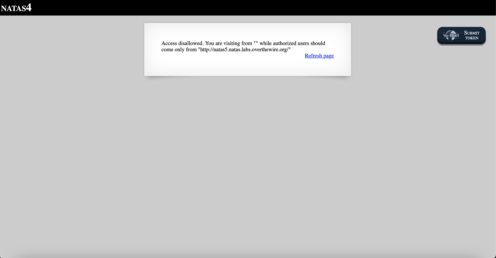
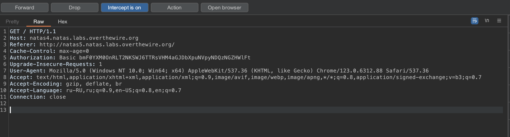
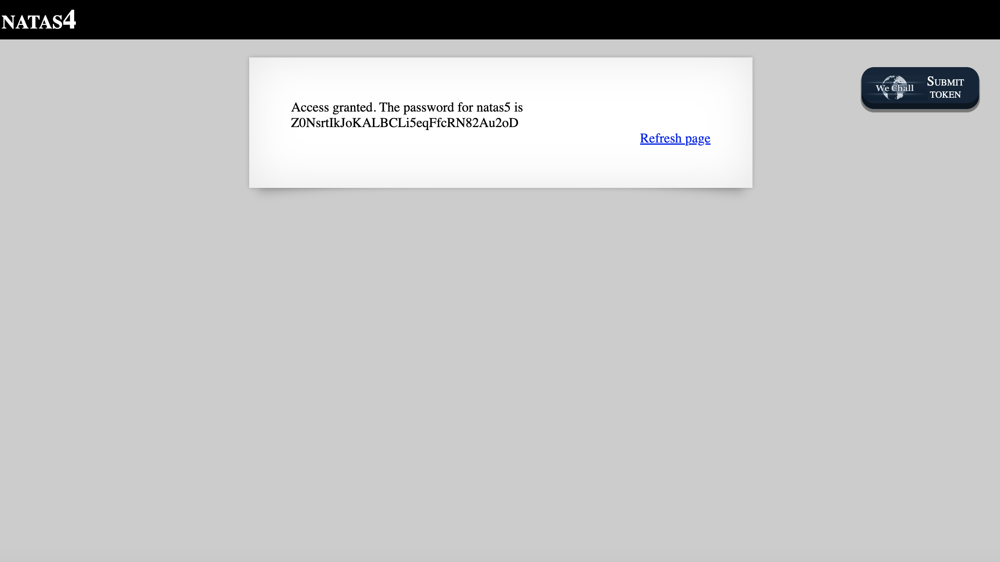

# Level 4

## Challenge Details 

- **CTF:** OverTheWire
- **Category:** Natas

## Provided Materials

- [http://natas4.natas.labs.overthewire.org](http://natas4.natas.labs.overthewire.org)
- username: `natas4`
- password: `tKOcJIbzM4lTs8hbCmzn5Zr4434fGZQm`

## Solution

It somehow checks from which url we are coming from...We need to have [Referer](https://en.wikipedia.org/wiki/HTTP_referer) header set to `http://natas5.natas.labs.overthewire.org/`. So we can intercept our request in [Burp Suite](https://www.google.com/search?client=safari&rls=en&q=burp+suite+community+edition&ie=UTF-8&oe=UTF-8) and modify it by adding the `Referer` header *(I won't discuss how to intercept requests in burp, because [here](https://www.youtube.com/watch?v=ouDe5sJ_uC8) you can watch and understand it in 5 minutes)*:

Then send the modified request:

## Password

`natas5`:`Z0NsrtIkJoKALBCLi5eqFfcRN82Au2oD`

*Created by [bu19akov](https://github.com/bu19akov)*