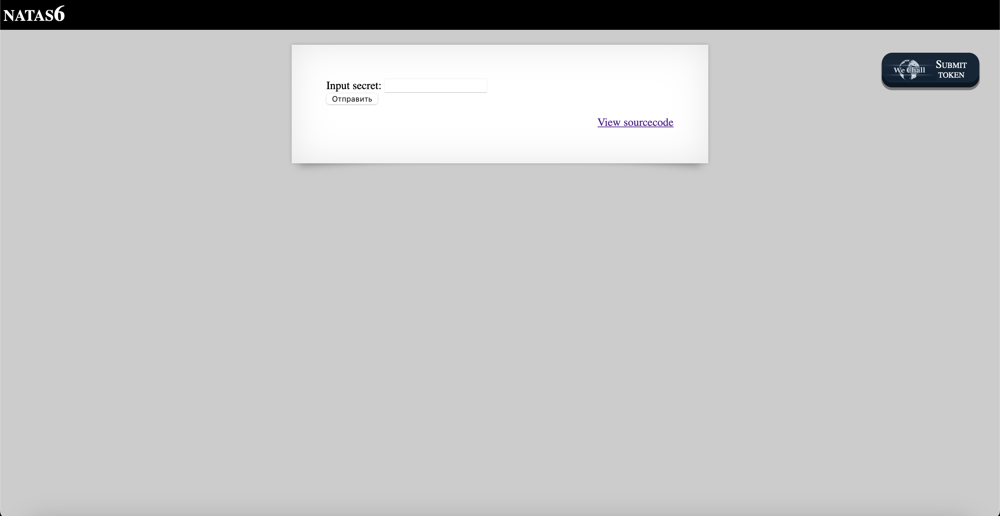

# Level 6

## Challenge Details 

- **CTF:** OverTheWire
- **Category:** Natas

## Provided Materials

- [http://natas6.natas.labs.overthewire.org](http://natas6.natas.labs.overthewire.org)
- username: `natas6`
- password: `fOIvE0MDtPTgRhqmmvvAOt2EfXR6uQgR`

## Solution



Let's see sourcecode:

```php
...

<?

include "includes/secret.inc";

    if(array_key_exists("submit", $_POST)) {
        if($secret == $_POST['secret']) {
        print "Access granted. The password for natas7 is <censored>";
    } else {
        print "Wrong secret";
    }
    }
?>
...
```

We can see `include` from `includes/secret.inc`, so let's open it [http://natas6.natas.labs.overthewire.org/includes/secret.inc](http://natas6.natas.labs.overthewire.org/includes/secret.inc):

So our secret is `FOEIUWGHFEEUHOFUOIU` and now we can enter it to get the password.

## Password

`natas7`:`jmxSiH3SP6Sonf8dv66ng8v1cIEdjXWr`

*Created by [bu19akov](https://github.com/bu19akov)*