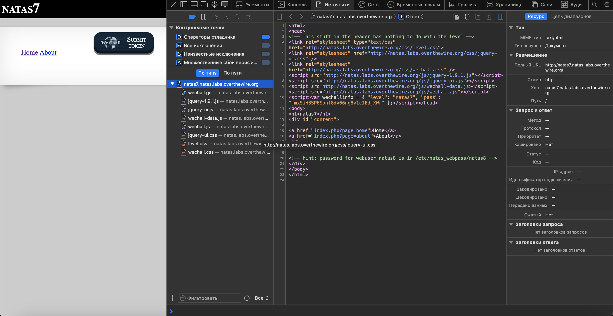
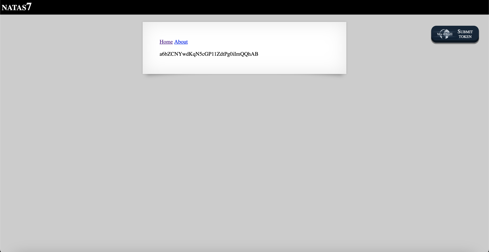

# Level 7

## Challenge Details 

- **CTF:** OverTheWire
- **Category:** Natas

## Provided Materials

- [http://natas7.natas.labs.overthewire.org](http://natas7.natas.labs.overthewire.org)
- username: `natas7`
- password: `jmxSiH3SP6Sonf8dv66ng8v1cIEdjXWr`

## Solution

`<!-- hint: password for webuser natas8 is in /etc/natas_webpass/natas8 -->`

The attack is called `File Inclusion Attack` *(More about it [here](https://book.hacktricks.xyz/pentesting-web/file-inclusion))*. So basically, after word `page` in `index.php?page=home` we can enter any file to open from the system if it is not secure, so let's try to open [http://natas7.natas.labs.overthewire.org/index.php?page=/etc/natas_webpass/natas8](http://natas7.natas.labs.overthewire.org/index.php?page=/etc/natas_webpass/natas8):

## Password

`natas8`:`a6bZCNYwdKqN5cGP11ZdtPg0iImQQhAB`

*Created by [bu19akov](https://github.com/bu19akov)*