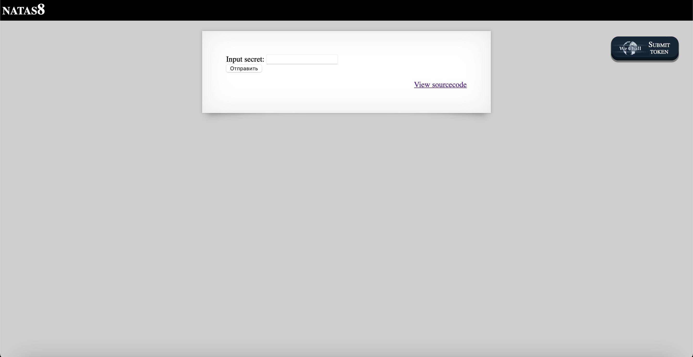

# Level 8

## Challenge Details 

- **CTF:** OverTheWire
- **Category:** Natas

## Provided Materials

- [http://natas8.natas.labs.overthewire.org](http://natas8.natas.labs.overthewire.org)
- username: `natas8`
- password: `a6bZCNYwdKqN5cGP11ZdtPg0iImQQhAB`

## Solution



Let's see the sourcecode:

```php
...
<?

$encodedSecret = "3d3d516343746d4d6d6c315669563362";

function encodeSecret($secret) {
    return bin2hex(strrev(base64_encode($secret)));
}

if(array_key_exists("submit", $_POST)) {
    if(encodeSecret($_POST['secret']) == $encodedSecret) {
    print "Access granted. The password for natas9 is <censored>";
    } else {
    print "Wrong secret";
    }
}
?>
...
```

We can see, that we have `encodedSecret` that was firstly base64 encoded, then reversed and then converted to hex, so we need to revert those operations to get the plain `secret`. We can use [CyberChef](https://gchq.github.io/CyberChef/) for this task:


Output: `oubWYf2kBq` *(Link to operations [here](https://gchq.github.io/CyberChef/#recipe=From_Hex('Auto')Reverse('Character')From_Base64('A-Za-z0-9%2B/%3D',true,false)&input=M2QzZDUxNjM0Mzc0NmQ0ZDZkNmMzMTU2Njk1NjMzNjI))*. When we enter it, we will get our password.

## Password

`natas9`:`Sda6t0vkOPkM8YeOZkAGVhFoaplvlJFd`

*Created by [bu19akov](https://github.com/bu19akov)*