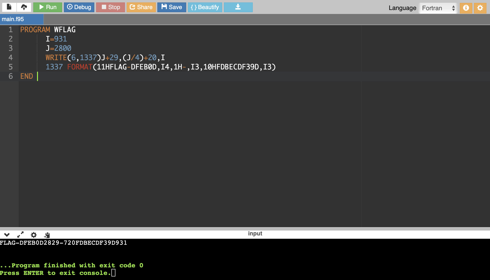

# Ask your grandpa again!

## Challenge Details 

- **CTF:** RingZer0
- **Category:** Coding Challenges
- **Points:** 4

## Provided Materials

- 6 punch cards

## Solution

The way, how to decode the `punch card` is explained in my solution for the [Ask your grandpa!](https://github.com/bu19akov/CTF-Challenge-Solutions/blob/main/RingZer0_CTF/coding_challanges/Ask%20your%20grandpa!%20(2p)/solution.md) challenge. 

The difference is, that now we need to process 6 files, instead of one.

So with some slightly modifications to the `python` code from `Ask your grandpa!` we can proceed with all the files at once:

```python
from PIL import Image
import glob

# Constants defining the dimensions and positions for decoding
COLUMN_WIDTH = 52
ROW_HEIGHT = 150
START_X = 155
START_Y = 170
THRESHOLD = 25  # Threshold for determining whether a position is punched
NUM_COLUMNS = 80
NUM_ROWS = 12

# Mapping of punched positions to characters
CHAR_MAP = {
    0: ' ',  # No punches
    1: "0123456789?-&",  # Single punch mapping
    2: {  # Double punch mapping
        12: "ABCDEFGHI",
        11: "JKLMNOPQR",
        0: "/STUVWXYZ",
        8: ":#@'\"="
    },
    3: {  # Triple punch mapping
        12: " .<|(+",
        11: "$*);)",
        0: "_%,>?"
    }
}

def get_punched_positions(pixels, column_index):
    """Determines the punched positions for a given column."""
    punched = []
    for row_index in range(NUM_ROWS):
        x = column_index * COLUMN_WIDTH + START_X
        y = row_index * ROW_HEIGHT + START_Y
        if pixels[x, y][0] < THRESHOLD:
            punched.append(row_index)
    return adjust_punched_positions(punched)

def adjust_punched_positions(punched):
    """Adjusts punched positions to match the character map indices."""
    adjusted = []
    for p in punched:
        if p > 1:
            adjusted.append(p - 2)
        else:
            adjusted.append(12 - p)
    return adjusted

def decode_character(punched):
    """Decodes a character from the list of punched positions."""
    length = len(punched)
    if length == 0:
        return CHAR_MAP[0]
    elif length == 1:
        return CHAR_MAP[1][punched[0]]
    elif length >= 2:
        special_key = punched[0] if punched[0] in CHAR_MAP[length] else punched[1]
        index = punched[1] if punched[0] == special_key else punched[0]
        return CHAR_MAP[length][special_key][index - 1]

def decode_card(image_path):
    """Decodes the entire card from the image file."""
    card = Image.open(image_path)
    pixels = card.load()
    w, _ = card.size

    decoded_text = []
    for column in range(NUM_COLUMNS):
        if column * COLUMN_WIDTH + START_X > w:
            break
        punched = get_punched_positions(pixels, column)
        decoded_text.append(decode_character(punched))

    return "".join(decoded_text)

def decode_all_cards(directory_path):
    """Decodes all .jpg files in the specified directory."""
    file_paths = glob.glob(directory_path)
    decoded_texts = {}

    for file_path in file_paths:
        decoded_text = decode_card(file_path)
        decoded_texts[file_path] = decoded_text

    return decoded_texts

# Usage
decoded_data = decode_all_cards("punchcard/*.jpg")

for file_name, data in decoded_data.items():
    #print(f"Decoded data from {file_name}:")
    print(data)
```

Output:

```
1337 FORMAT(11HFLAG-DFEB0D,I4,1H-,I3,10HFDBECDF39D,I3)               13370050
      J=2800                                                         13370030
      I=931                                                          13370020
      WRITE(6,1337)J+29,(J/4)+20,I                                   13370040
      PROGRAM WFLAG                                                  13370010
      END                                                            13370060
```

The numbers on the right side look like the order, so with some reordering we get:

```
PROGRAM WFLAG                                                     13370010
      I=931                                                       13370020
      J=2800                                                      13370030
      WRITE(6,1337)J+29,(J/4)+20,I                                13370040
      1337 FORMAT(11HFLAG-DFEB0D,I4,1H-,I3,10HFDBECDF39D,I3)      13370050
END                                                               13370060
```

We can identify the `Fortran` programming language, so we can use [online Fortran compiler](https://www.onlinegdb.com/online_fortran_compiler) to compile it:




## Final Flag

`FLAG-DFEB0D2829-720FDBECDF39D931`

*Created by [bu19akov](https://github.com/bu19akov)*