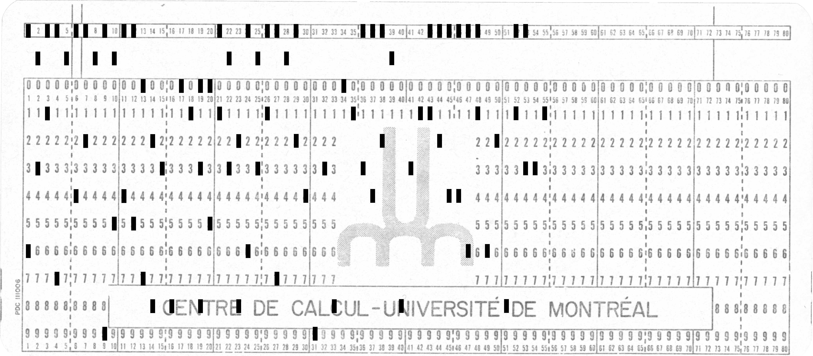

# Ask your grandpa!

## Challenge Details 

- **CTF:** RingZer0
- **Category:** Coding Challenges
- **Points:** 2

## Provided Materials

- Image:

## Solution

The name of the chellenge gives us a hint, that it is something `old` and indeed this is a [punch card](https://www.computerhope.com/jargon/p/punccard.htm). So with the help of [this](https://craftofcoding.wordpress.com/2017/01/28/read-your-own-punch-cards/) article we can manually decode the `punch card`.

## Final Flag

`FLAG-B493801CDB-831ABDDFA628AC31`

*Created by [bu19akov](https://github.com/bu19akov)*
