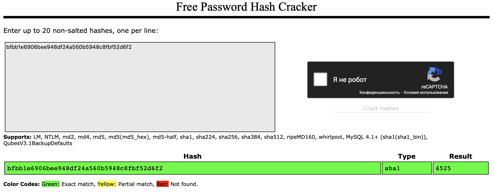

# Hash breaker

## Challenge Details 

- **CTF:** RingZer0
- **Category:** Coding Challenges
- **Points:** 4

## Provided Materials

- Web page with hash

## Solution

We need to break the hash and send it back to `http://challenges.ringzer0team.com:10056/?r=[your_response]`. So when we first open the page we see the hash, let's firstly understand, what type of hash it is. We will use [CrackStation](https://crackstation.net) for that:



We see, that algorithm [SHA1](https://en.wikipedia.org/wiki/SHA-1) was used and the value of cracked hash is `4525`. We can crack one more hash to make sure, that probably only 4-digit numbers will be hashed. And we were right. So we can solve it with `python`:

```python
import requests
import hashlib
import re
from bs4 import BeautifulSoup

# The URL of the challenge
challenge_url = "http://challenges.ringzer0team.com:10056"

# The URL to send the response to
response_url_template = "http://challenges.ringzer0team.com:10056/?r={}"

# Start a session to persist cookies and headers
session = requests.Session()

def extract_hash(page_content):
    """
    This function extracts the hash from the HTML content and cleans it of any <br> tags.
    """
    match = re.search(r'----- BEGIN HASH -----(.*)----- END HASH -----', page_content, re.DOTALL | re.S)
    if match:
        # Clean the matched hash value by removing <br> tags
        hash_value = re.sub(r'<br\s*/?>', '', match.group(1).strip()).strip()
        return hash_value
    return None

def crack_sha1_hash(hash_value):
    """
    This function attempts to crack the given SHA-1 hash knowing that it's between 0000 and 9999.
    """
    for number in range(10000):
        # Format the number with leading zeros
        attempt = f"{number}"
        # Check if the hash of the current number matches the target hash
        if hashlib.sha1(attempt.encode('utf-8')).hexdigest() == hash_value:
            return attempt
    return None

def send_response(response):
    """
    This function sends the cracked hash response back to the server.
    """
    response_url = response_url_template.format(response)
    response = session.get(response_url)
    return response.content

def extract_flag(page_content):
    """
    This function extracts the FLAG from the HTML content using BeautifulSoup.
    """
    soup = BeautifulSoup(page_content, 'html.parser')
    message_div = soup.find('div', class_='alert alert-info')
    if message_div:
        message = message_div.get_text(strip=True)
        return message
    return None

def main():
    # Get the page content from the challenge URL
    response = session.get(challenge_url)
    if response.ok:
        # Extract the hash from the page
        hash_value = extract_hash(response.text)

        if hash_value:
            print(hash_value)
            # Attempt to crack the hash
            original_number = crack_sha1_hash(hash_value)
            if original_number:
                # Send the response back to the server
                final_result = send_response(original_number)
                print(extract_flag(final_result.decode('utf-8')))
            else:
                print("Failed to crack the hash.")
        else:
            print("Could not find the hash in the page.")
    else:
        print(f"Failed to retrieve the challenge page, status code: {response.status_code}")

if __name__ == "__main__":
    main()
```


## Final Flag

`FLAG-G1095M88Tk837G9AC0EA6q3N`

*Created by [bu19akov](https://github.com/bu19akov)*