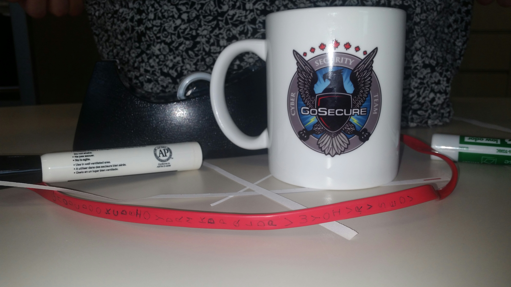

# Crypto Object

## Challenge Details 

- **CTF:** RingZer0
- **Category:** Cryptography
- **Points:** 4

## Provided Materials

- Image:



## Solution

The message on this red stripe is `GMODCDOOKCDBIOYDRMKDPQLDPVWYOIVRVSEOV`.

The plastic strip gives us a small hint, that it could be [Scytale Cipher](https://en.wikipedia.org/wiki/Scytale).

With following script we can perform all shift combinations and output only those strings, that contain letters `F`, `L`, `A` and `G`:

```python
def rot_cipher_decrypt(text, shift):
    result = ""
    for char in text:
        if char.isalpha():  # Check if character is an alphabet
            # Shift character, keeping case in mind
            shifted = ord(char) + shift
            if char.islower():
                if shifted > ord('z'):
                    shifted -= 26
                elif shifted < ord('a'):
                    shifted += 26
            elif char.isupper():
                if shifted > ord('Z'):
                    shifted -= 26
                elif shifted < ord('A'):
                    shifted += 26
            result += chr(shifted)
        else:
            result += char
    return result

def contains_all_letters(text, letters):
    return all(letter in text for letter in letters)

def find_letters(text, letters):
    for shift in range(26):
        decrypted = rot_cipher_decrypt(text, shift)
        if contains_all_letters(decrypted, letters):
            print(f"Shift {shift}: {decrypted}")

# Your string
encrypted_string = "GMODCDOOKCDBIOYDRMKDPQLDPVWYOIVRVSEOV"
letters_to_find = "FLAG"
find_letters(encrypted_string, letters_to_find)
```

Output:

```sh
Shift 10: QWYNMNYYUMNLSYINBWUNZAVNZFGIYSFBFCOYF
Shift 15: VBDSRSDDZRSQXDNSGBZSEFASEKLNDXKGKHTDK
Shift 16: WCETSTEEASTRYEOTHCATFGBTFLMOEYLHLIUEL
Shift 20: AGIXWXIIEWXVCISXLGEXJKFXJPQSICPLPMYIP
```

When we analyze the `Shift 16` and divide it on three parts (based on `Scytale Cipher`:

```sh
W C E T S T E E A S T R Y
E O T H C A T F G B T F
L M O E Y L H L I U E L
```

The `flag` is in front of us! We need to read the text vertically:

```sh
WELCOME TO THE SCYTALE THE FLAG IS BUTTERFLY
```

## Final Flag

`BUTTERFLY `

*Created by [bu19akov](https://github.com/bu19akov)*