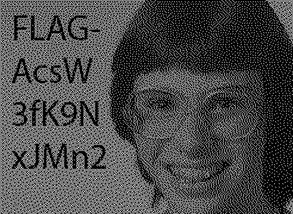

# Fashion Victim

## Challenge Details 

- **CTF:** RingZer0
- **Category:** Cryptography
- **Points:** 2

## Provided Materials

- [Link](https://ringzer0ctf.com/challenges_page/tv_091091d3cfcf927ea012e773b60f9010.html) to the web page

## Solution

This is how the website looks:


As we open it, we can notice, that the image inside the `Apple TV` is probably `gif`. We can open `Web Inspector` (MacOS - `⌥⌘i`, Windows - `Ctrl + Shift + i`) and download `tv.gif` file.

`gif` files consist of many frames *(read [here](https://en.wikipedia.org/wiki/GIF))*, so we can extract all of them (total 31):

```python
def extract_frames(gif_path):
    frames = []
    with Image.open(gif_path) as img:
        if not img.is_animated:
            raise ValueError(f"The file {gif_path} is not an animated GIF.")

        frame_count = img.n_frames
        for frame in range(frame_count):
            img.seek(frame)
            frames.append(img.copy())
    return frames
```

When we analyze those frames, we can't notice something suspicious, so we need to process it further. We can perform [bitwise operation](https://www.geeksforgeeks.org/python-pil-logical_and-and-logical_or-method/) with images, so we can do `logical and` operation on all pairs of extracted frames:

```python
def bitwise_and_all_combinations(frames):
    and_frames = []
    for frame1, frame2 in itertools.combinations(frames, 2):
        and_frame = ImageChops.logical_and(frame1.convert('1'), frame2.convert('1'))
        and_frames.append(and_frame)
    return and_frames
```

Also we can exclude all duplicate files (with the same `MD5` hash value, read [here](https://www.quora.com/What-is-the-MD5-hash-value-for-an-image#:~:text=APRIL%2020%2C%202022-,What%20is%20MD5%20hash%20for%20picture%3F,raw%20data%20of%20the%20file.)):

```python
def hash_image(image):
    """Calculate the hash of an image file."""
    hash_md5 = hashlib.md5()
    with open(image, "rb") as f:
        for chunk in iter(lambda: f.read(4096), b""):
            hash_md5.update(chunk)
    return hash_md5.hexdigest()
    
hashes = {}
for i, frame in enumerate(and_frames):
    frame_path = f"{output_folder}/and_combination_{i}.png"
    frame.save(frame_path)
    frame_hash = hash_image(frame_path)
    if frame_hash in hashes:
        # Delete if duplicate
        os.remove(frame_path)
    else:
        hashes[frame_hash] = frame_path
```

And indeed this leads us to the image with our `flag`:



Here is full code: [link](./solution.py)

## Final Flag

`FLAG-AcsW3fK9NxJMn2`

*Created by [bu19akov](https://github.com/bu19akov)*