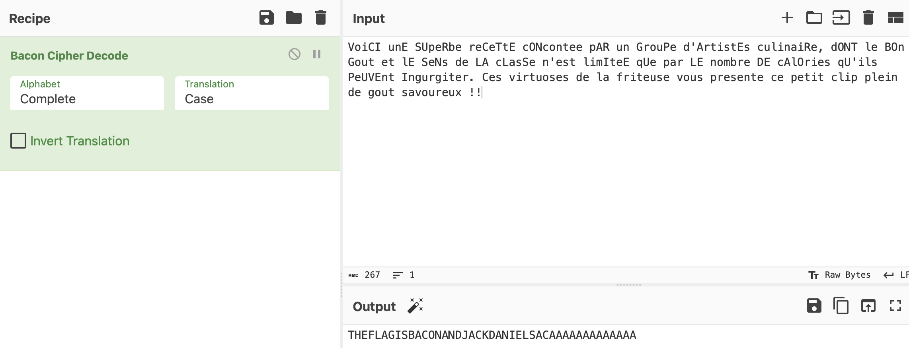

# Hangovers and more: Bacon

## Challenge Details 

- **CTF:** RingZer0
- **Category:** Cryptography
- **Points:** 3

## Provided Materials

- Piece of text:

	```
	VoiCI unE SUpeRbe reCeTtE cONcontee pAR un GrouPe d'ArtistEs culinaiRe, dONT le BOn Gout et lE SeNs
	de LA cLasSe n'est limIteE qUe par LE nombre DE cAlOries qU'ils PeUVEnt Ingurgiter. Ces virtuoses
	de la friteuse vous presente ce petit clip plein de gout savoureux !!
	```

## Solution

The name of the challenge gives us a hint, so we search for [Bacon Cipher](https://en.wikipedia.org/wiki/Bacon%27s_cipher). 

We can create a script, where each capital letter will be represented as `B` and each lowercase letter as `A` and then map each 5 characters sequence to one letter, represented in `bacon_dict`:

```python
bacon_dict = {
    'AAAAA': 'A', 'AAAAB': 'B', 'AAABA': 'C', 'AAABB': 'D', 'AABAA': 'E',
    'AABAB': 'F', 'AABBA': 'G', 'AABBB': 'H', 'ABAAA': 'I', 'ABAAB': 'J',
    'ABABA': 'K', 'ABABB': 'L', 'ABBAA': 'M', 'ABBAB': 'N', 'ABBBA': 'O',
    'ABBBB': 'P', 'BAAAA': 'Q', 'BAAAB': 'R', 'BAABA': 'S', 'BAABB': 'T',
    'BABAA': 'U', 'BABAB': 'V', 'BABBA': 'W', 'BABBB': 'X', 'BBAAA': 'Y',
    'BBAAB': 'Z'
}


message = "VoiCI unE SUpeRbe reCeTtE cONcontee pAR un GrouPe d'ArtistEs culinaiRe, dONT le BOn Gout et lE SeNs de LA cLasSe n'est limIteE qUe par LE nombre DE cAlOries qU'ils PeUVEnt Ingurgiter. Ces virtuoses de la friteuse vous presente ce petit clip plein de gout savoureux !!"

# Remove all non-letter characters from the message
cleaned_message = ''.join(filter(str.isalpha, message))

# Convert to A's and B's based on the case of each letter
encoded_message = ['A' if char.islower() else 'B' for char in cleaned_message]

# Group into sets of 5
grouped_message = [''.join(encoded_message[i:i+5]) for i in range(0, len(encoded_message), 5)]

# Translate using the Bacon cipher dictionary
decoded_message = ''
for group in grouped_message:
    if group in bacon_dict:
        decoded_message += bacon_dict[group]
    else:
        decoded_message += '?'  # If a group doesn't match, mark with a question mark

# Output the result
print(decoded_message)

# Look for the flag pattern, which usually starts with 'FLAG'
import re
flag_pattern = re.compile(r'FLAG[A-Z0-9]+')
flag_match = flag_pattern.search(decoded_message)

if flag_match:
    print(f"Flag found: {flag_match.group(0)}")
else:
    print("Flag pattern not found.")
```

We can also refer to [CyberChef](https://gchq.github.io/CyberChef/) to find the `flag`:



## Final Flag

`BACONANDJACKDANIELS`

*Created by [bu19akov](https://github.com/bu19akov)*