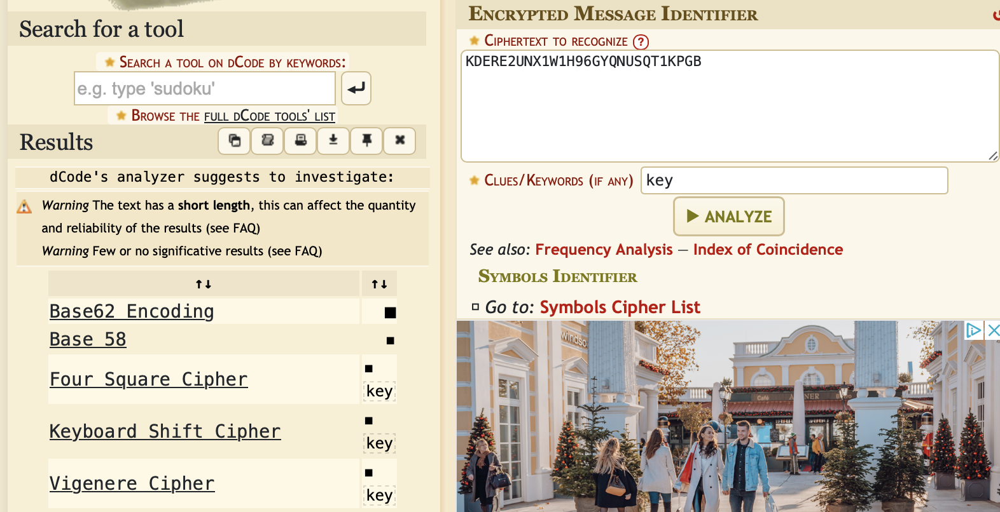
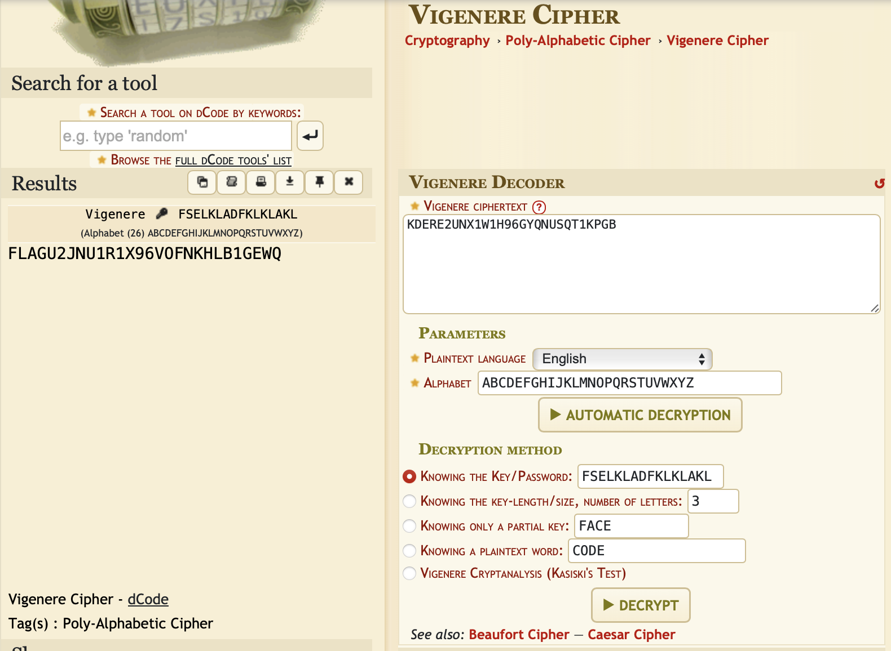

# Martian message part 2

## Challenge Details 

- **CTF:** RingZer0
- **Category:** Cryptography
- **Points:** 2

## Provided Materials

- Text `KDERE2UNX1W1H96GYQNUSQT1KPGB` and key `fselkladfklklakl`

## Solution

We know, that it will be cipher with key, so we can use [Cipher Identifier](https://www.dcode.fr/cipher-identifier) and see, which ciphers are using key to en-/decrypt the message:

When we try [Vigenere cipher](https://en.wikipedia.org/wiki/Vigenère_cipher) with our `message` and `key`, we can see our decrypted `flag`:

## Final Flag

`FLAGU2JNU1R1X96VOFNKHLB1GEWQ `

*Created by [bu19akov](https://github.com/bu19akov)*