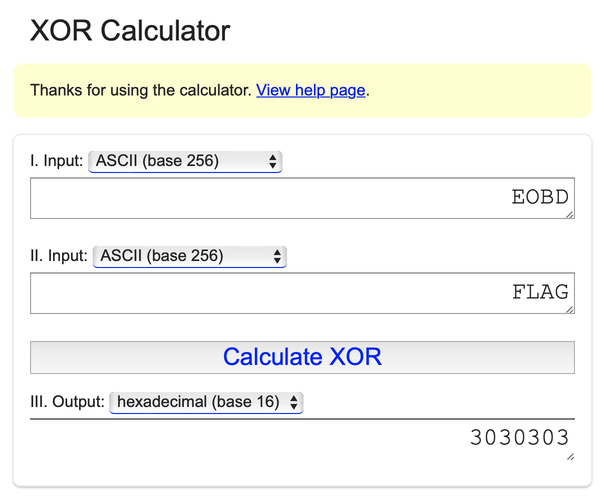
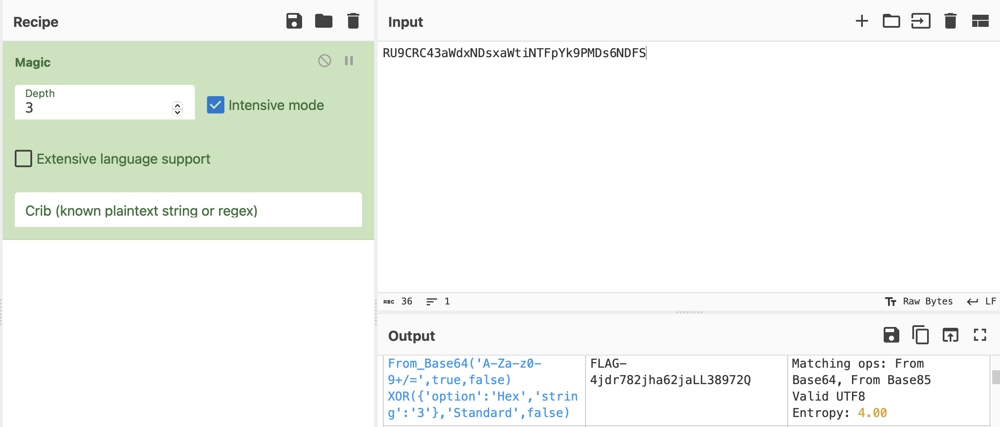

# Martian message part 3

## Challenge Details 

- **CTF:** RingZer0
- **Category:** Cryptography
- **Points:** 3

## Provided Materials

- Piece of text: `RU9CRC43aWdxNDsxaWtiNTFpYk9PMDs6NDFS`

## Solution

There are only aphanumeric characters and the number of characters is divisible by 4, so we can try to decode it with `base64`:

```sh
$ echo "RU9CRC43aWdxNDsxaWtiNTFpYk9PMDs6NDFS" | base64 -d   
EOBD.7igq4;1ikb51ibOO0;:41R
```

This gives us another string, where `EOBD` looks like `FLAG`... What if it is simply `xored`? We can use this [XOR Calculator](https://xor.pw/#) to find it out:



And indeed it seems to be `xored` by `3`, so our next step is to `xor` the whole string with `3`:

```python
import base64

Xorflag = base64.b64decode('RU9CRC43aWdxNDsxaWtiNTFpYk9PMDs6NDFS')
flag = ''

for i in Xorflag:
    flag = flag + chr(i ^ 3)

print(flag)
```

This gives us our `flag`.

Also we can simply use [CyberChef](https://gchq.github.io/CyberChef/) with `Magic Recipe`:



## Final Flag

`FLAG-4jdr782jha62jaLL38972Q`

*Created by [bu19akov](https://github.com/bu19akov)*