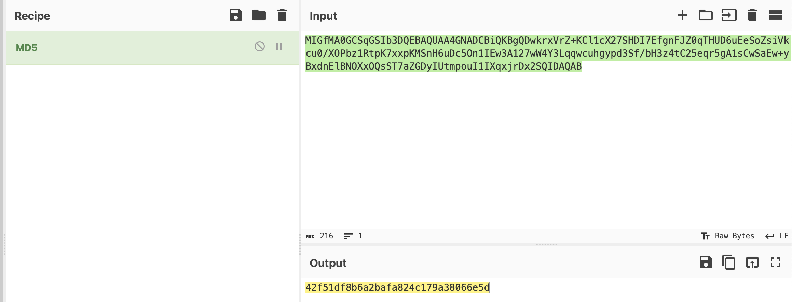

# Public key recovery

## Challenge Details 

- **CTF:** RingZer0
- **Category:** Cryptography
- **Points:** 2

## Provided Materials

- [RSA private key](https://www.ibm.com/docs/en/zos/2.1.0?topic=keys-rsa-private-public)

## Solution

We need to find out, how to generate `public key` from `private key`. With a little bit googling, we get following [page](https://stackoverflow.com/questions/5244129/use-rsa-private-key-to-generate-public-key). So firstly we need to write our `private key` to the file `priv.key` and then execute:

```sh
openssl rsa -in priv.key -pubout -out pub.key
```

Next, we need to generate [MD5 Checksum](https://www.tecmint.com/generate-verify-check-files-md5-checksum-linux/):

1. We can use `md5sum` command from previous link:

	```sh
	$ echo -n "MIGfMA0GCSqGSIb3DQEBAQUAA4GNADCBiQKBgQDwkrxVrZ+KCl1cX27SHDI7EfgnFJZ0qTHUD6uEeSoZsiVkcu0/XOPbz1RtpK7xxpKMSnH6uDc5On1IEw3A127wW4Y3Lqqwcuhgypd3Sf/bH3z4tC25eqr5gA1sCwSaEw+yBxdnElBNOXxOQsST7aZGDyIUtmpouI1IXqxjrDx2SQIDAQAB" | md5sum 
42f51df8b6a2bafa824c179a38066e5d  -
```

2. We can use [CyberChef](https://gchq.github.io/CyberChef/) to generate `MD5 Checksum`:

	
	
Next we input our `MD5 Checksum` on the page and receive our flag.

## Final Flag

`FLAG-9869O2dQ43d1r116kfD0Sj5n`

*Created by [bu19akov](https://github.com/bu19akov)*