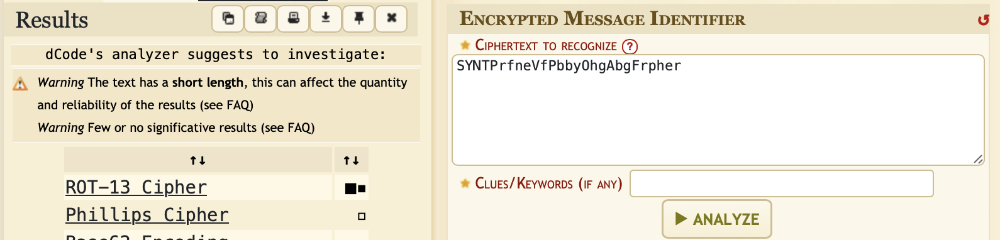
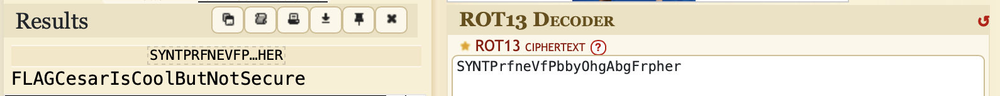

# Some martian message

## Challenge Details 

- **CTF:** RingZer0
- **Category:** Cryptography
- **Points:** 1

## Provided Materials

- Piece of text: `SYNTPrfneVfPbbyOhgAbgFrpher`

## Solution

Every time we see some strange cryptographic text, we can use [Cipher Identifier Tool](https://www.dcode.fr/cipher-identifier):

Here we can identify, that it's [ROT-13 Cipher](https://en.wikipedia.org/wiki/ROT13), so we can decrypt our text with [ROT-13 Decoder](https://www.dcode.fr/rot-13-cipher):

## Final Flag

`FLAGCesarIsCoolButNotSecure`

*Created by [bu19akov](https://github.com/bu19akov)*