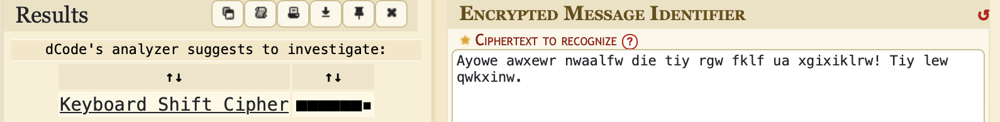
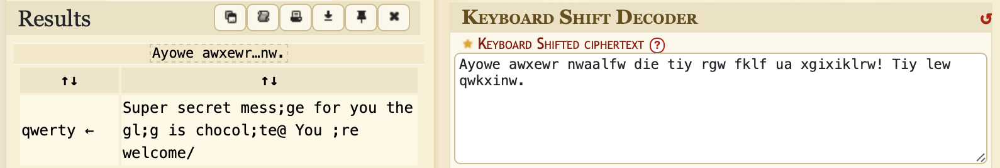

# You're Drunk!

## Challenge Details 

- **CTF:** RingZer0
- **Category:** Cryptography
- **Points:** 1

## Provided Materials

- Piece of text: `Ayowe awxewr nwaalfw die tiy rgw fklf ua xgixiklrw! Tiy lew qwkxinw.`

## Solution

Every time we see some strange cryptographic text, we can use [Cipher Identifier Tool](https://www.dcode.fr/cipher-identifier):

Here we can identify, that it's `Keyboard Shift Cipher`. So we can decode it with [Keyboard Shift Decoder](https://www.dcode.fr/keyboard-shift-cipher):

## Final Flag

`chocolate`

*Created by [bu19akov](https://github.com/bu19akov)*