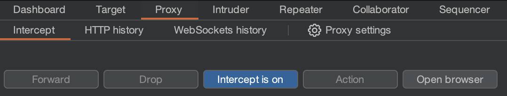
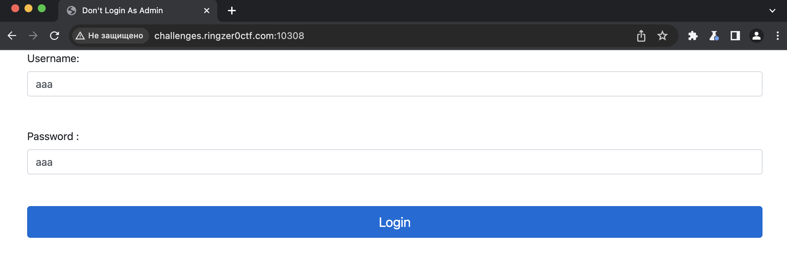
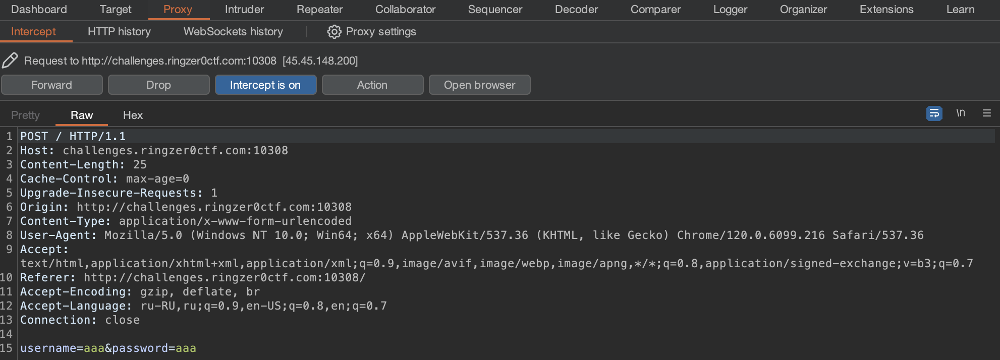
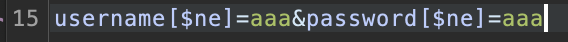
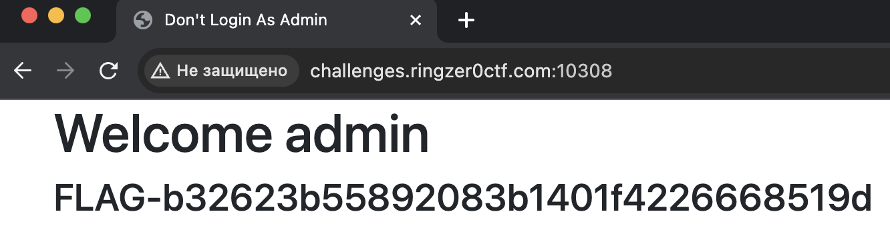

# DON'T login as admin

## Challenge Details 

- **CTF:** RingZer0
- **Category:** Exotic Data Storage
- **Points:** 2

## Provided Materials

- Login Form

## Solution

We know, that this will be `Exotic Data Storage`, so no basic `SQLi`. What else do we have? We have `NoSQL` and rather [MongoDB](https://en.wikipedia.org/wiki/MongoDB). So we will try to use [NoSQL Injection](https://book.hacktricks.xyz/pentesting-web/nosql-injection) here. For that we will need to capture our request. We can use [Burp Suite Community Edition](https://portswigger.net/burp/communitydownload) *(comprehensive suite of tools for web application security testing)*. If you are unfamiliar with this tool, you can read [Basic Burp Suite Tutorial](https://portswigger.net/burp/documentation/desktop/getting-started).

Firstly, we need to intercept our request, so we go to `Proxy` in the navigation bar, then click on `Intercept is off` button *(that will turn on interception mode)* and finally click on `Open Browser` *(Burp has built-in `Chrominium` web browser)*:

When our browser opens, we can navigate to our destination adress, enter any credentials and press `Login` *(This will send POST request, that will be intercept by Burp)*:

Now in `Burp` in the same menu we will have our intercepted request, that we can modify:

So exactly here we will modify our `Request Body Parameters` *(username and password)* and inject our `NoSQL` query:

*(Can read more [here](https://www.mongodb.com/docs/manual/reference/operator/query/ne/) about `$ne` operator)*

And we get our flag:

## Final Flag

`FLAG-b32623b55892083b1401f4226668519d`

*Created by [bu19akov](https://github.com/bu19akov)*