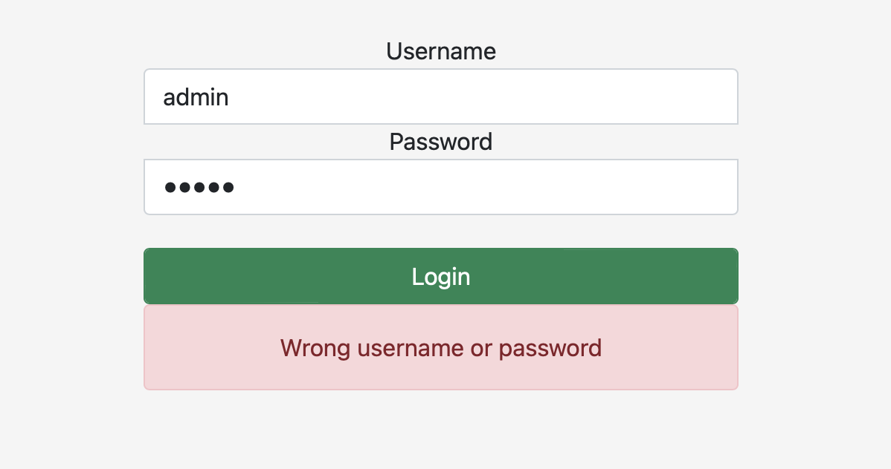
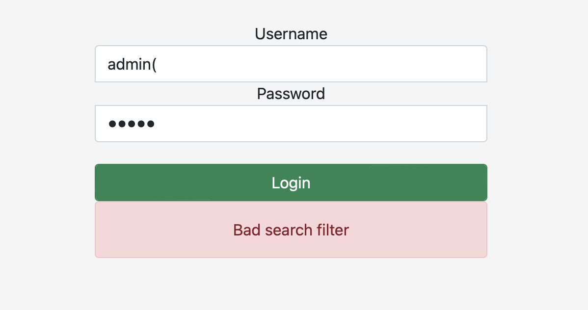
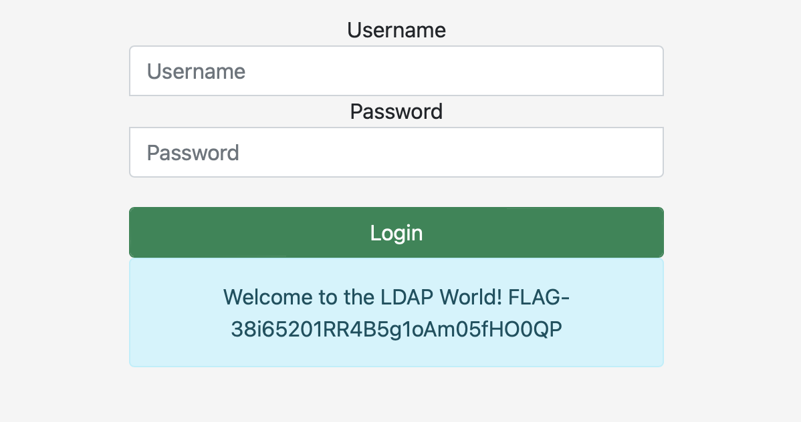

# Just another login form

## Challenge Details 

- **CTF:** RingZer0
- **Category:** Exotic Data Storage
- **Points:** 2

## Provided Materials

- Login Form

## Solution

When we try to log in as `admin` we receive `Wrong username or password`:

As the challenge category is `Exotic Data Storage` and not `SQL Injection`, we won't try `SQLi` here. So we try to add `(`, and we get:

Wow! We found [LDAP Injection Vulnerability](https://www.synopsys.com/glossary/what-is-ldap-injection.html). Our next step is described in the previous link, so we try to enter `*` as both username and password:

## Final Flag

`FLAG-38i65201RR4B5g1oAm05fHO0QP`

*Created by [bu19akov](https://github.com/bu19akov)*