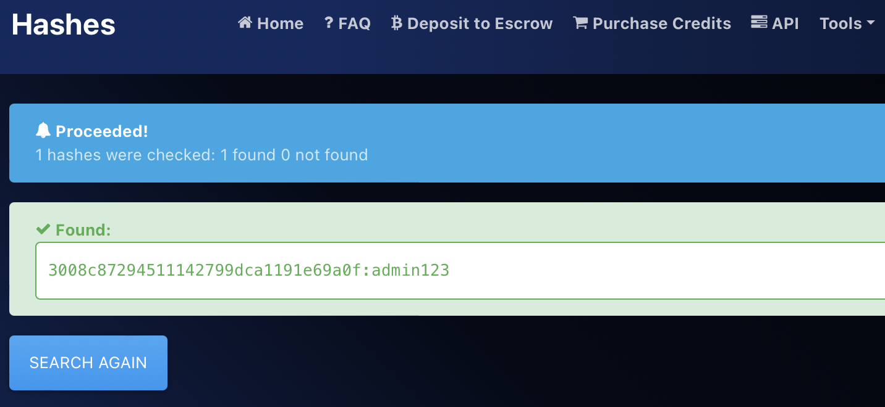

# 3 / 3 Suspicious account password?

## Challenge Details 

- **CTF:** RingZer0
- **Category:** Forensics
- **Points:** 4

## Provided Materials

- File

## Solution

*(First read [1 / 3 Do not waste the environment](https://github.com/bu19akov/CTF-Challenge-Solutions/blob/main/RingZer0_CTF/forensics/1%20-%203%20Do%20not%20waste%20the%20environment%20(2p)/solution.md) and [2 / 3 Did you see my desktop?](https://github.com/bu19akov/CTF-Challenge-Solutions/blob/main/RingZer0_CTF/forensics/2%20-%203%20Did%20you%20see%20my%20desktop%3F%20(3p)/solution.md))*.

So we need to analyze our file further and as the name suggest we need to find acount password. For that we can dump all the passwords with:

```sh
$ vol -f 5bd2510a83e82d271b7bf7fa4e0970d1 windows.hashdump.Hashdump
Volatility 3 Framework 2.5.0
Progress:  100.00		PDB scanning finished                        
User	rid	lmhash	nthash

Administrator	500	aad3b435b51404eeaad3b435b51404ee	31d6cfe0d16ae931b73c59d7e0c089c0
Guest	501	aad3b435b51404eeaad3b435b51404ee	31d6cfe0d16ae931b73c59d7e0c089c0
flag	1000	aad3b435b51404eeaad3b435b51404ee	3008c87294511142799dca1191e69a0f
```

We have found user `flag` and its [NTLM](https://en.wikipedia.org/wiki/NTLM) hashed password `3008c87294511142799dca1191e69a0f`.

We can use [hashes.com](https://hashes.com/en/decrypt/hash) to decrypt our hash:



## Final Flag

`admin123`

*Created by [bu19akov](https://github.com/bu19akov)*