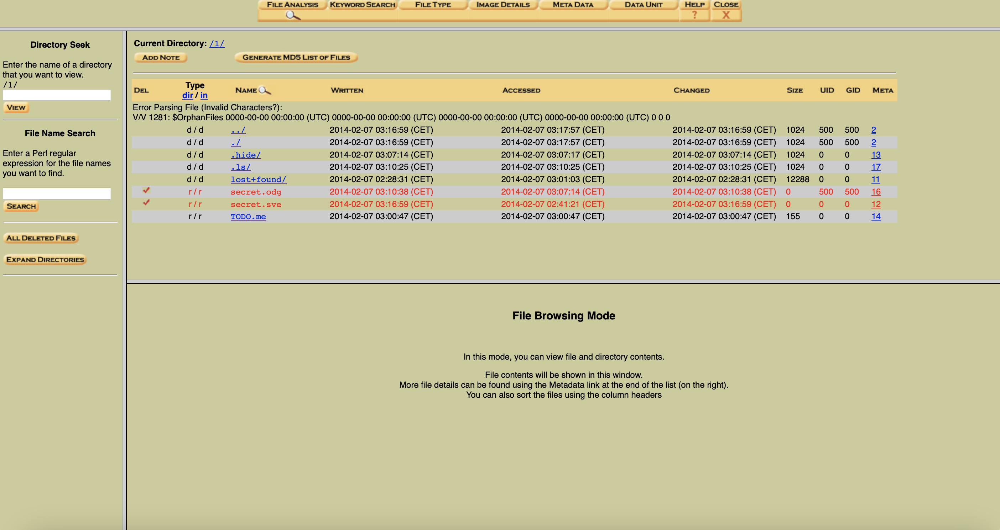
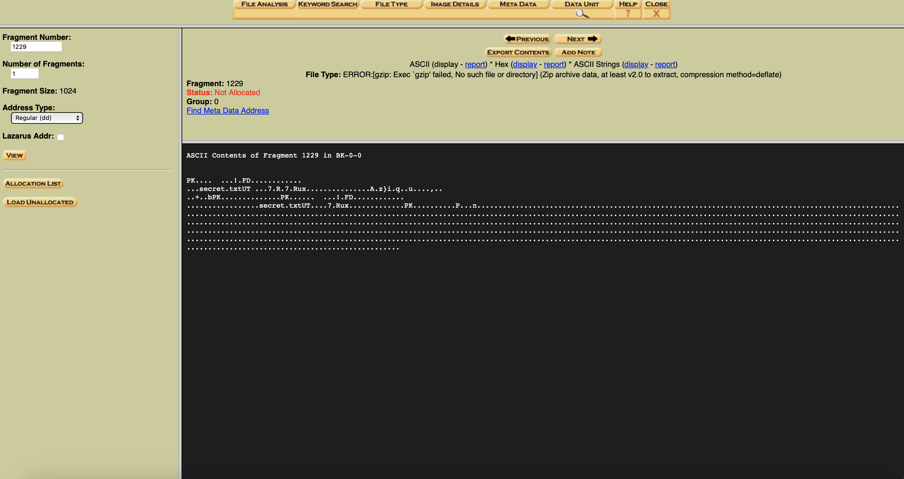

# Agent Smith reloaded

## Challenge Details 

- **CTF:** RingZer0
- **Category:** Forensics
- **Points:** 4

## Provided Materials

- Linux rev 1.0 ext3 filesystem data

## Solution

*Read [Attention Dinosaure Survive](https://github.com/bu19akov/CTF-Challenge-Solutions/blob/main/RingZer0_CTF/forensics/Attention%20Dinosaure%20Survive%20(2p)/solution.md) first to familiarize yourself with `Autopsy`.*

When we first open our file in `Autopsy` we see, that there are some deleted files:



And if we press `All Deleted Files` we see, that those files are empty in `Autopsy`. So probably they are not allocated.

By analyzing not allocated memory, we can find `secret.txt` file:



We can export it (this is `.zip` file) and save as `secret.zip`. But we need a password to open it, so let's use [John the Ripper](https://www.openwall.com/john/) to crack the password:

```sh
$ zip2john secret.zip > john.txt
$ john --wordlist=/dictionaries/rockyou.txt john.txt
```

Password is `12345`. When we unzip `secret.zip` we get our `secret.txt` file.


## Final Flag

`FLAG-menummenum`

*Created by [bu19akov](https://github.com/bu19akov)*