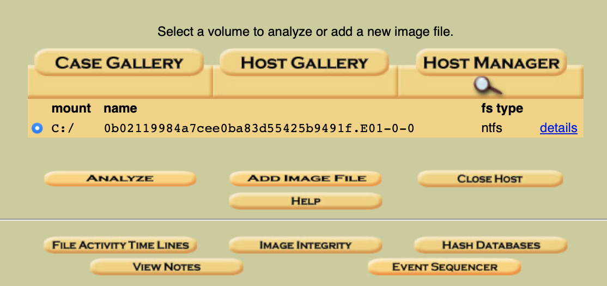

# Attention Dinosaure Survive

## Challenge Details 

- **CTF:** RingZer0
- **Category:** Forensics
- **Points:** 2

## Provided Materials

- file `0b02119984a7cee0ba83d55425b9491f.E01`

## Solution

We can start by analyzing the file type:

```sh
$ file 0b02119984a7cee0ba83d55425b9491f.E01
0b02119984a7cee0ba83d55425b9491f.E01: EWF/Expert Witness/EnCase image file format
```

It's [Expert Witness File](https://www.loc.gov/preservation/digital/formats/fdd/fdd000406.shtml), so it can be analyzed with [Autopsy](http://www.sleuthkit.org/autopsy/):

```sh
$ autopsy

============================================================================

                       Autopsy Forensic Browser 
                  http://www.sleuthkit.org/autopsy/
                             ver 2.24 

============================================================================
Evidence Locker: /usr/local/var/lib/autopsy
Start Time: Mon Feb  5 19:43:29 2024
Remote Host: localhost
Local Port: 9999

Open an HTML browser on the remote host and paste this URL in it:

    http://localhost:9999/autopsy

Keep this process running and use <ctrl-c> to exit
```

When we navigate to `http://localhost:9999/autopsy`, we will see following:


I have already added the case, but you can do it by pressing `New Case` and then give the name to the case:


Then we need to press `OK` from the `Case Gallery Menu` and add out host:


We just need to give it a name:


Then press `Add Host` and on the next screen press `Add Image File`:


We need to enter the full path of our file and select `Partition`:


After adding the `Image` we can press `Analyze` to start analyzing the `Disk Partition`:



Under `4/Dinosaure.txt:flag.txt` we can find our flag:


## Final Flag

`flag-6b96e212b3f85968db654f7892f06122`

*Created by [bu19akov](https://github.com/bu19akov)*