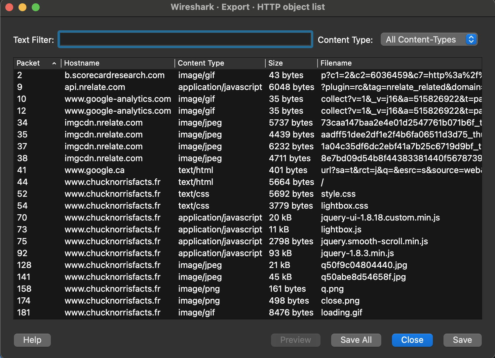

# Hey Chuck where is the flag?

## Challenge Details 

- **CTF:** RingZer0
- **Category:** Forensics
- **Points:** 2

## Provided Materials

- `.pcap` file

## Solution

We need to analyze the file, for that we will use [Wireshark](https://www.wireshark.org) *(packet analysis and capture tool)*:


We see a lot of `HTTP` traffic, so we can try to export `HTTP Objects` *(`File` -> `Export Objects` -> `HTTP`)*:



We can save them all and analyze. The content of `askldj3lkj234.php` is:

```sh
Hey this is a flag FLAG-GehFMsqCeNvof5szVpB2Dmjx
```

## Final Flag

`FLAG-GehFMsqCeNvof5szVpB2Dmjx`

*Created by [bu19akov](https://github.com/bu19akov)*