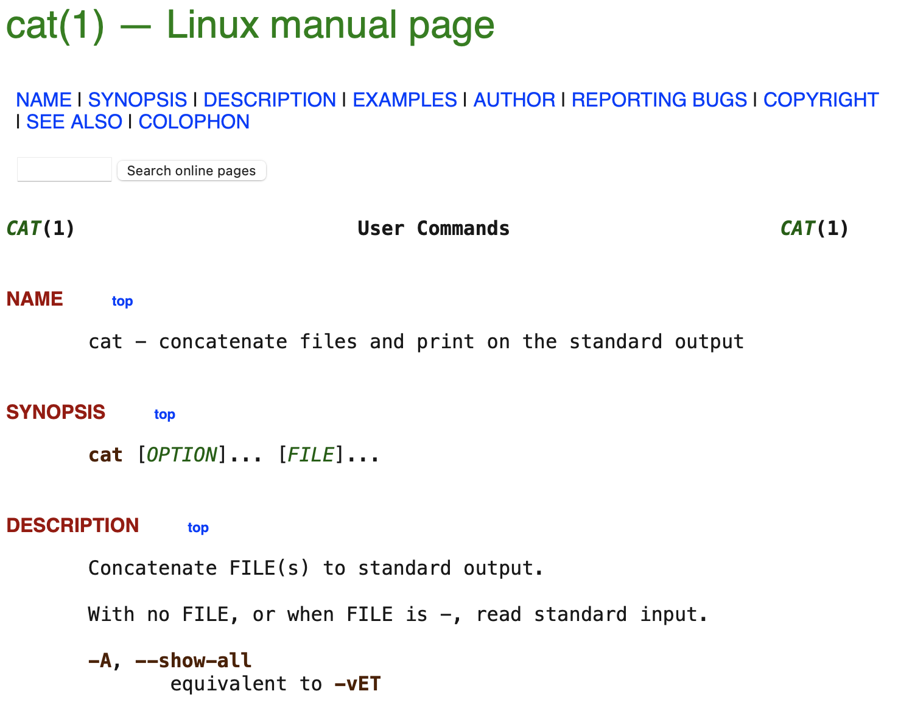

# I love cat

## Challenge Details 

- **CTF:** RingZer0
- **Category:** Forensics
- **Points:** 2

## Provided Materials

- ssh credentials

## Solution

We can see, that there is `flag.txt` file:

```sh
$ ls -al
total 24
drwxr-x--- 3 root cat  4096 Feb 16  2022 .
drwxr-xr-x 4 root root 4096 Feb 16  2022 ..
-rw-r--r-- 1 root root  221 Jul 17  2019 .bash_profile
-rwxr-x--- 1 cat  cat  3771 Feb 16  2022 .bashrc
drwxr-xr-x 2 cat  cat  4096 Jan 12  2022 commands
-rw-r--r-- 1 root root  116 Jul 17  2019 flag.txt
```

Let's output it:

```sh
$ cat flag.txt 
**************************** WHERE IS THE FLAG ? ****************************
```

Hm, let's analyze our shell further:

```sh
$ export
declare -x HOME="/home/cat"
declare -x LANG="en_US.UTF-8"
declare -x LOGNAME="cat"
declare -x MOTD_SHOWN="pam"
declare -x OLDPWD
declare -rx PATH="/home/cat/commands"
declare -x PWD="/home/cat"
declare -rx SHELL="/bin/rbash"
declare -x SHLVL="1"
declare -x SSH_CLIENT="46.109.195.140 57500 22"
declare -x SSH_CONNECTION="46.109.195.140 57500 10.66.241.17 22"
declare -x SSH_TTY="/dev/pts/1"
declare -x TERM="xterm-256color"
declare -x USER="cat"
declare -x XDG_RUNTIME_DIR="/run/user/1001"
declare -x XDG_SESSION_CLASS="user"
declare -x XDG_SESSION_ID="151594"
declare -x XDG_SESSION_TYPE="tty"
```

So our shell is `rbash` and we can only use commands from `commands` directory, probably `cat` and `ls`. Let's take a look at [cat manual page](https://www.man7.org/linux/man-pages/man1/cat.1.html):



`-A` flag looks interesting, let's try it:

```sh
$ cat -A flag.txt 
FLAG-0K14eDrm4t5g7KD54X8Dl3NNcZ956oCK^M**************************** WHERE IS THE FLAG ? ****************************$
```

## Final Flag

`FLAG-0K14eDrm4t5g7KD54X8Dl3NNcZ956oCK`

*Created by [bu19akov](https://github.com/bu19akov)*