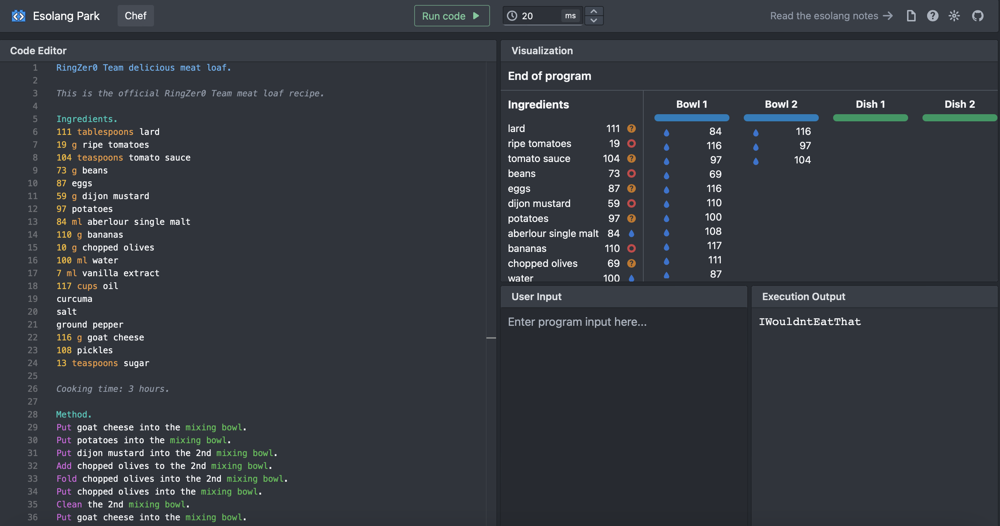

# Meat Loaf

## Challenge Details 

- **CTF:** RingZer0
- **Category:** Forensics
- **Points:** 2

## Provided Materials

- Some recipe

## Solution

We can see two parts in our recipe: `Ingredients` and `Method`. In `Ingredients` part most of the values are `ASCII` values... This can be some kind of programming language! And indeed it's [Chef](https://esolangs.org/wiki/Chef) *(Chef is a stack-based language where programs look like cooking recipes)*. 

So we quickly find an online [Chef Interpreter](https://esolangpark.vercel.app/ide/chef) and run our recipe:

## Final Flag

`IWouldntEatThat `

*Created by [bu19akov](https://github.com/bu19akov)*