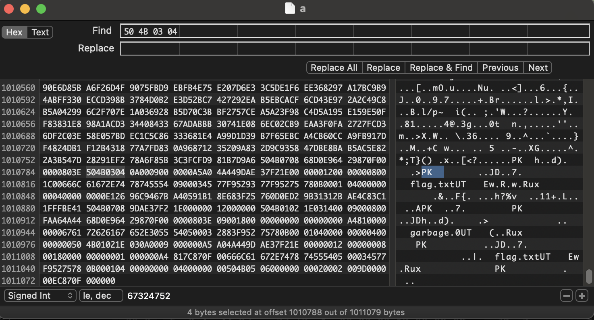

# Poor internet connection

## Challenge Details 

- **CTF:** RingZer0
- **Category:** Forensics
- **Points:** 4

## Provided Materials

- `.pcap` file

## Solution

We have to analyze `.pcap` file. We can use [Wireshark](https://www.wireshark.org) for it. When we open the file we see a lot of `TCP` traffic, so we can try to extract `HTTP Objects` *(`File` -> `Export Objects` -> `HTTP`)*:

We have found `secret.txt`, and its content: `the password for zip file is : ZipYourMouth`. So we need to search for `.zip` file inside our `.pcap` file. 
All files have their [signatures](https://en.wikipedia.org/wiki/List_of_file_signatures), so we can search in `Wireshark's` packet bytes for `50 4B 03 04` *(`.zip` file first hex values)*:

We have found `.zip` file signature in packet `1139`. We can follow `TCP Stream` *(`Analyze` -> `Follow` -> `TCP Stream`)* to extract full `.zip` file:

We should save it as `Raw` and then using `HEX Editor` open it:

Next, we need do delete everything, that comes before `file signature bytes`, so the final file will look as follows:

And then open it using password, that we have found before. This gives us `flag.txt` file.

## Final Flag

`Flag-qscet5234diQ`

*Created by [bu19akov](https://github.com/bu19akov)*