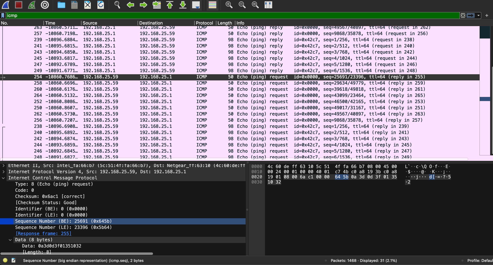
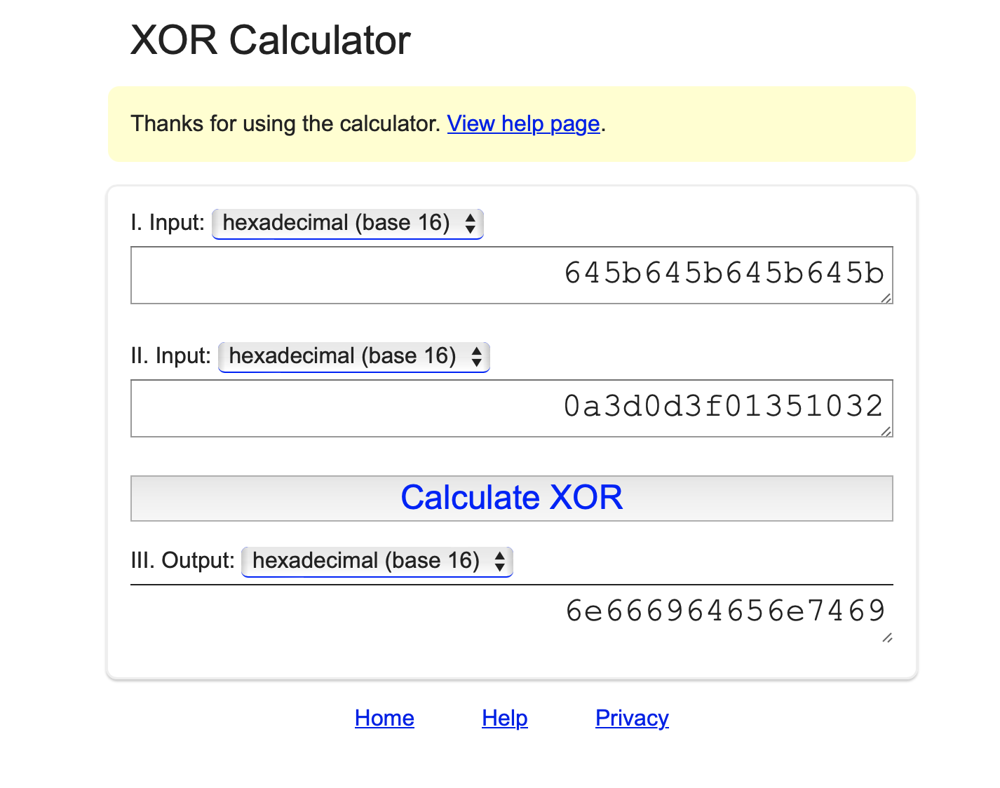
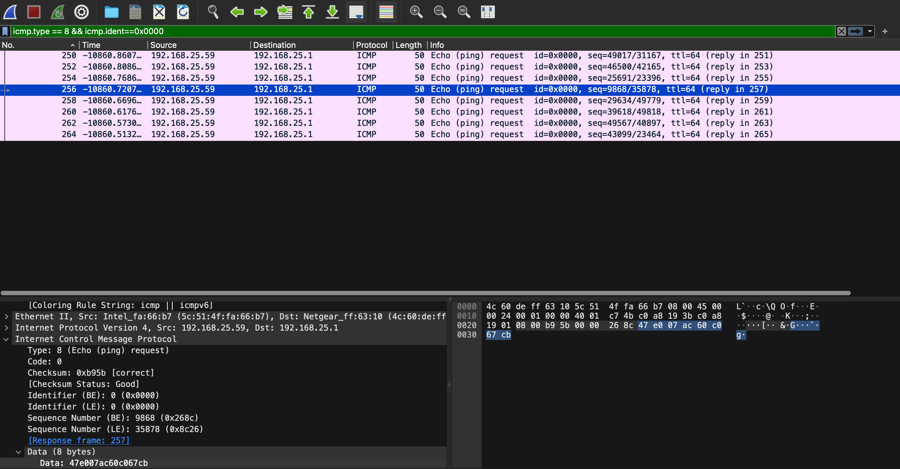

# Someone steal my flag again

## Challenge Details 

- **CTF:** RingZer0
- **Category:** Forensics
- **Points:** 5

## Provided Materials

- `pcap` file

## Solution

Read [Someone steal my flag!](https://github.com/bu19akov/CTF-Challenge-Solutions/blob/main/RingZer0_CTF/forensics/Someone%20steal%20my%20flag!%20(3p)/solution.md) first.

Based on the last challenge, we can try to filter `ICMP` packets again:



We can see some strange `sequence number` *(0x645b)* in some of the packets and the `data` is `8 bytes` *(0a3d0d3f01351032)* instead of `40`, so let's try to `xor` those values:



Then `hex` to `string`:

```sh
$ echo "6e666964656e7469" | xxd -r -p
nfidenti
```

Hm, it's something meaningful. We can filter all of the strange `ICMP requests` with `icmp.type == 8 && icmp.ident==0x0000` and sort by number:



Then save it to file *(Like in `Someone steal my flag!`)*.

And we can create `python` script to read the needed data from the file and provide an output:

```py
import re

def xor_hex(hex1, hex2):
    result = int(hex1, 16) ^ int(hex2, 16)
    return '{:x}'.format(result).zfill(len(hex2))

# Path to your input file
file_path = './diss.txt'

# Regular expressions to match the sequence number and data
seq_regex = re.compile(r'Sequence Number \(BE\): (\d+) \((0x[a-fA-F0-9]+)\)')
data_regex = re.compile(r'Data: ([a-fA-F0-9]+)')

# Lists to hold extracted sequence numbers and data
sequences = []
data_values = []

# Read the file and extract sequence numbers and data
with open(file_path, 'r') as file:
    for line in file:
        seq_match = seq_regex.search(line)
        if seq_match:
            # Ensure the sequence number is repeated to be 16 characters long
            sequence = seq_match.group(2)[2:]  # Remove '0x' prefix
            sequences.append(sequence * (16 // len(sequence)))
        data_match = data_regex.search(line)
        if data_match:
            data_values.append(data_match.group(1))

# Perform XOR on the sequence numbers and data
xor_results = [xor_hex(seq, data) for seq, data in zip(sequences, data_values)]

# Concatenate all XOR results into a single hex string
final_xor_result = ''.join(xor_results)

# Convert hex to bytes
bytes_from_hex = bytes.fromhex(final_xor_result)

# Convert bytes to string
ascii_string = bytes_from_hex.decode('ascii')

print(ascii_string)
```

Output:

```
This is super confidential! FLAG-4338J10B01I7Bzo6LT1ROhy00000LEX
```

`00000` is padding.


## Final Flag

`FLAG-4338J10B01I7Bzo6LT1ROhyLEX`

*Created by [bu19akov](https://github.com/bu19akov)*