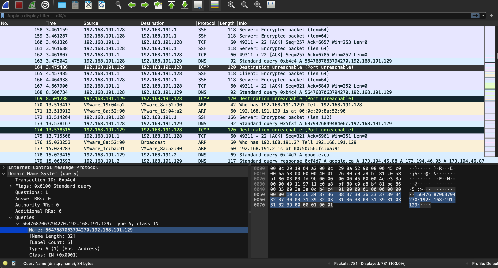
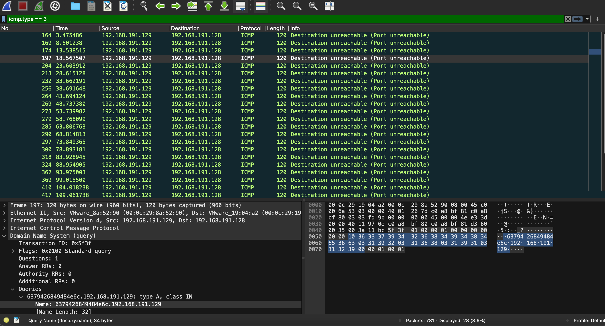

# Someone steal my flag!

## Challenge Details 

- **CTF:** RingZer0
- **Category:** Forensics
- **Points:** 3

## Provided Materials

- `.pcap` file

## Solution

We can analyze the `.pcap` files with [Wireshark](https://www.wireshark.org).

By analyzing the file we can notice some hex data before `IP` address in `ICMP` relplies `Port unreachable`:



Let's see if it contains something meaningful:

```sh
$ echo "5647687063794270" | xxd -r -p 
VGhpcyBp
```

Hm, probably `base64` encoded...?

```sh
$ echo "VGhpcyBp" | base64 -d
This i
```

Indeed, we are on the right path. So we can use `icmp.type == 3` filter to show only `ICMP Port unreachable` packets:



And then save them to the file *(`File` -> `Export Packet Dissections` -> `As Plain Text`)*.

Then we can create `python` script to decode all hidden data in those packets:

```py
import re
import base64

# Path to your file (change this to the actual path of your file)
file_path = './diss.txt'

# Regular expression to match the relevant part of the lines
regex = r'Name: ([0-9a-f]+)\.192\.168\.191\.129'

# List to hold extracted hex parts
hex_parts = []

# Read the file and extract hex parts and remove duplicates
current = ""
with open(file_path, 'r') as file:
    for line in file:
        match = re.search(regex, line)
        if match:
            hex_part = match.group(1)
            if hex_part != current:
                current = hex_part
                hex_parts.append(hex_part)

# Combine all hex parts into a single string
combined_hex = "".join(hex_parts)

# Convert hex to bytes
bytes_from_hex = bytes.fromhex(combined_hex)

# Convert bytes to string assuming it's ASCII
ascii_string = bytes_from_hex.decode('ascii')

# Base64 decode the ASCII string
decoded_base64 = base64.b64decode(ascii_string)

print(decoded_base64)

```

Output:

```
This is a secret transmitted through dns query :) FLAG-FT47cMX26pWyFSI6RPWaSr5YRw
```


## Final Flag

`FLAG-FT47cMX26pWyFSI6RPWaSr5YRw`

*Created by [bu19akov](https://github.com/bu19akov)*