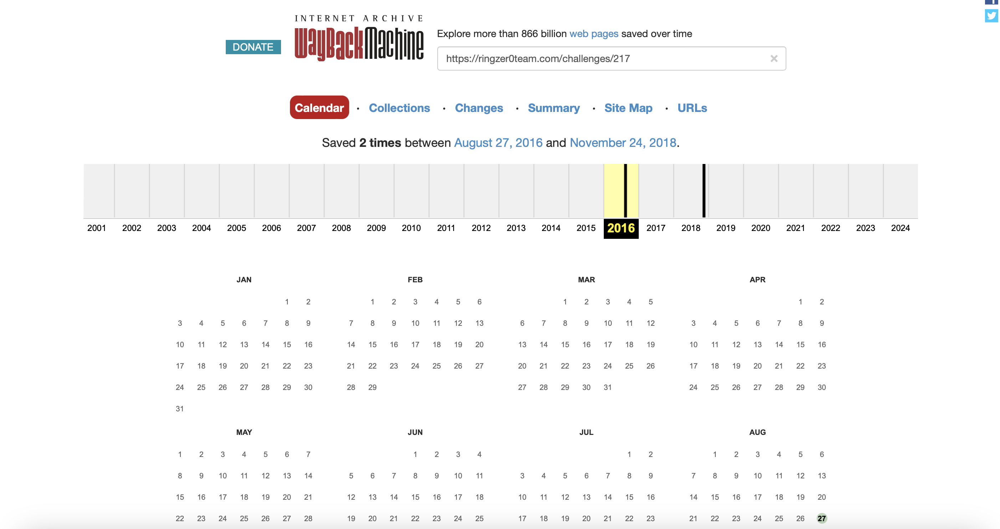
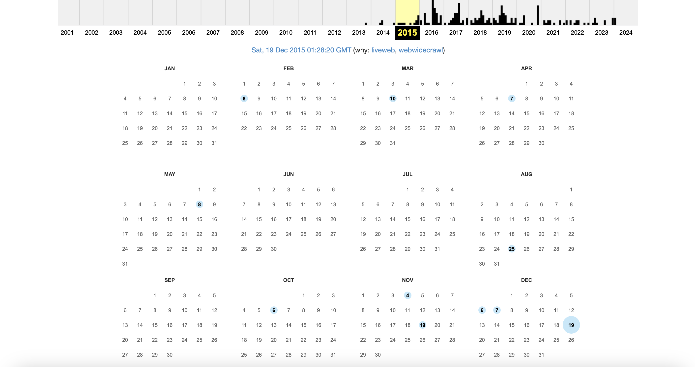
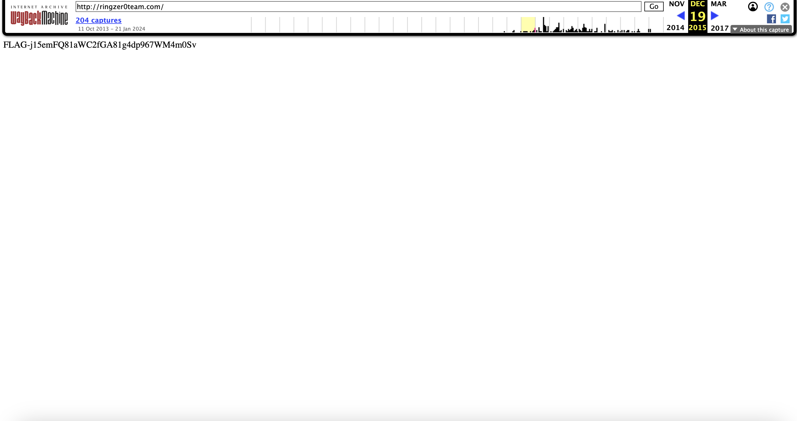

# The good, the bad and the ugly

## Challenge Details 

- **CTF:** RingZer0
- **Category:** Forensics
- **Points:** 2

## Provided Materials

- Text: EvilCorp claiming that they hacked the RingZer0 Team website can you prove it?

## Solution

Firstly, let's find the date, when the challenge was created. For that we will use [Wayback Machine](https://archive.org/web/) *(digital archive of the World Wide Web)* and RingZer0 old domain `ringzer0team.com`:

Probably it's `27.08.2016`, so let's find the changes that were made to the `ringzer0team.com` before this date. One major change we found was on `19.12.2015`:

And indeed we found our flag [here](https://web.archive.org/web/20151219012820/http://ringzer0team.com/):

## Final Flag

`FLAG-j15emFQ81aWC2fGA81g4dp967WM4m0Sv`

*Created by [bu19akov](https://github.com/bu19akov)*