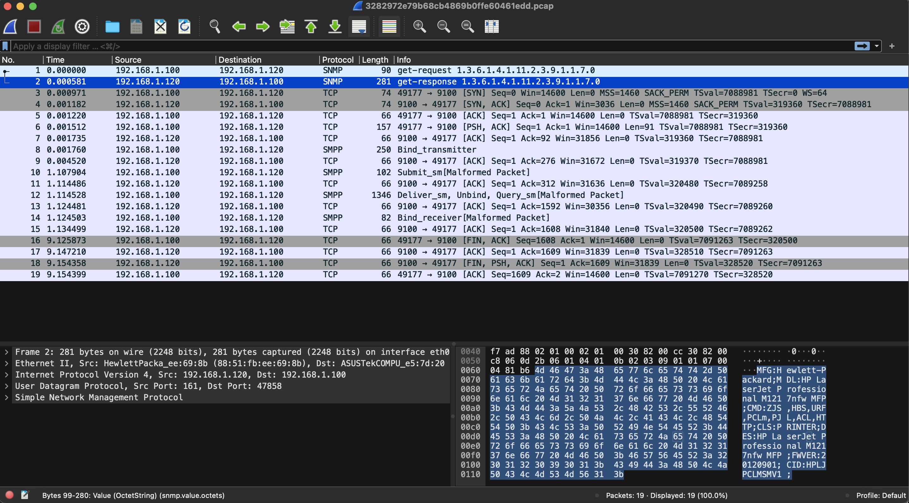
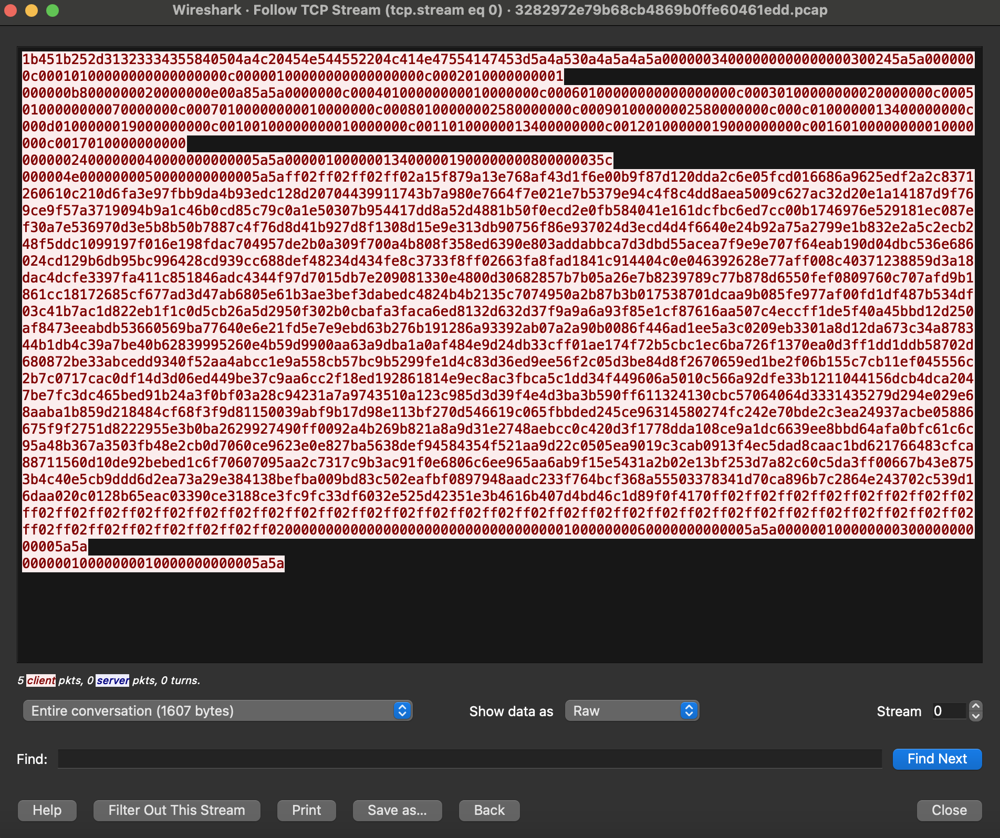
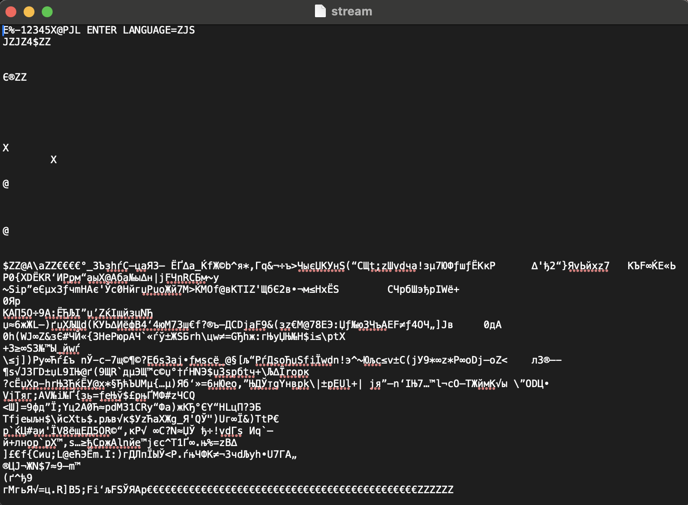

# The words flew but writing remains

## Challenge Details 

- **CTF:** RingZer0
- **Category:** Forensics
- **Points:** 3

## Provided Materials

- `.pcap` file

## Solution

By analyzing the `.pcap`file we can notice, that there is probably communication with `Hewlett-Packard` printer (it also use [port 9100](http://hacking-printers.net/wiki/index.php/Port_9100_printing)):



So we can follow `TCP Stream` *(`Analyze` -> `Follow` -> `TCP Stream`)*: 



We can save it to the file, called `stream` and analyze it:

```sh
$ file stream
stream: HP PCL printer data
```

And here is it's content:



So we have [PCL](https://en.wikipedia.org/wiki/Printer_Command_Language) file with [ZJS](https://en.wikipedia.org/wiki/Page_description_language) *(one of the page description languages)* set as language. If we delete the first line of the file, we will get:

```sh
$ file stream_zjs 
stream_zjs: Zenographics ZjStream printer data (big-endian)
```

So we need to find a way to convert `ZJS` to human-readable format. As I have MacOS, I couldn't use [zjsdecode](https://manpages.ubuntu.com/manpages/xenial/man1/zjsdecode.1.html) tool direct, so I have found it's [source code](https://github.com/koenkooi/foo2zjs/blob/master/zjsdecode.c) on GitHub and have compiled it locally:

```sh
$ brew install jbigkit
$ clang zjsdecode.c -o zjsdecode -L/usr/local/lib -ljbig -I/usr/local/include
```

Then by executing the script with `-d` flag *(for saving decompressed planes)*:

```sh
$ ./zjsdecode -d flag < stream_zjs
```

We can get our flag in a new file called `flag-01-1.pbm`:


## Final Flag

`FLAG-0CbxosBsb5TR3v0kPEtp`

*Created by [bu19akov](https://github.com/bu19akov)*