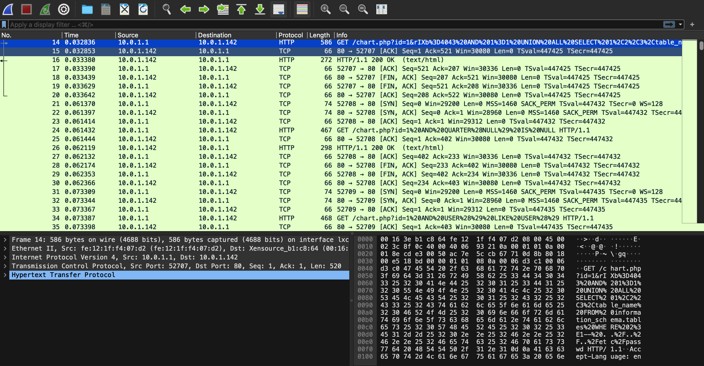
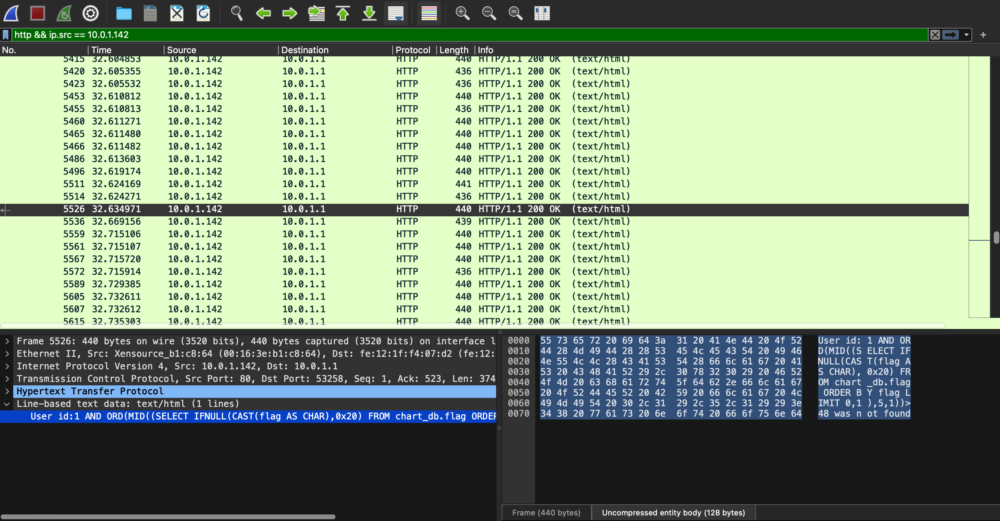

# We got breached

## Challenge Details 

- **CTF:** RingZer0
- **Category:** Forensics
- **Points:** 5

## Provided Materials

- `.pcap` file

## Solution

By analyzing the file we can notice, that there are many `GET` requests to the server with `/chart.php?id=1`:



By analyzing further with filter `http && ip.src == 10.0.1.142`, we can found server responses like

```sql
User id:1 
AND ORD(MID((
SELECT IFNULL(CAST(flag AS CHAR),0x20) 
FROM chart_db.flag 
ORDER BY flag 
LIMIT 0,1),5,1)) # 5,1 means return 5th char and only 1 char
>48 was not found # 48 is 0 in ASCII
```



We can save those packets *(server responses)* to the file *(`File` -> `Export Packet Dissections` -> `As Plain Text`)*.

The server respond with either `was found` or `was not found`. So we need to find only the lowest value for `was not found` for each position in `flag`. For example:

```sql
User id:1 
AND ORD(MID((
SELECT IFNULL(CAST(flag AS CHAR),0x20) 
FROM chart_db.flag 
ORDER BY flag 
LIMIT 0,1),1,1)) # First character in Flag
>70 was not found # 70 in ASCII is F
```

We can automate it with `python`:

```py
import re

# Define the path to your input file
file_path = './diss.txt'

# Initialize a dictionary to store the lowest number found for each position
# Initialize with high values assuming a realistic upper bound
lowest_numbers = {i: 999 for i in range(1, 38)}

# Compile the regex pattern to match the lines
pattern = re.compile(r'User id:1 AND ORD\(MID\(\(SELECT IFNULL\(CAST\(flag AS CHAR\),0x20\) FROM chart_db\.flag ORDER BY flag LIMIT 0,1\),(\d+),1\)\)>(\d+) was not found')

# Read the file and search for matching lines
with open(file_path, 'r', errors='ignore') as file:
    for line in file:
        match = pattern.search(line)
        if match:
            position = int(match.group(1))
            number = int(match.group(2))
            # Update the dictionary if a lower number is found for the position
            if number < lowest_numbers[position]:
                lowest_numbers[position] = number

# Print the lowest number found for each position
# for position in sorted(lowest_numbers.keys()):
#    print(f"Position {position}: {lowest_numbers[position]}")

ascii_string = ''.join(chr(lowest_numbers[pos]) for pos in sorted(lowest_numbers.keys()))

print(ascii_string)
```


## Final Flag

`FLAG-NJf3JS719aKHwa1zk50GQa6kJ8m1K2kR`

*Created by [bu19akov](https://github.com/bu19akov)*