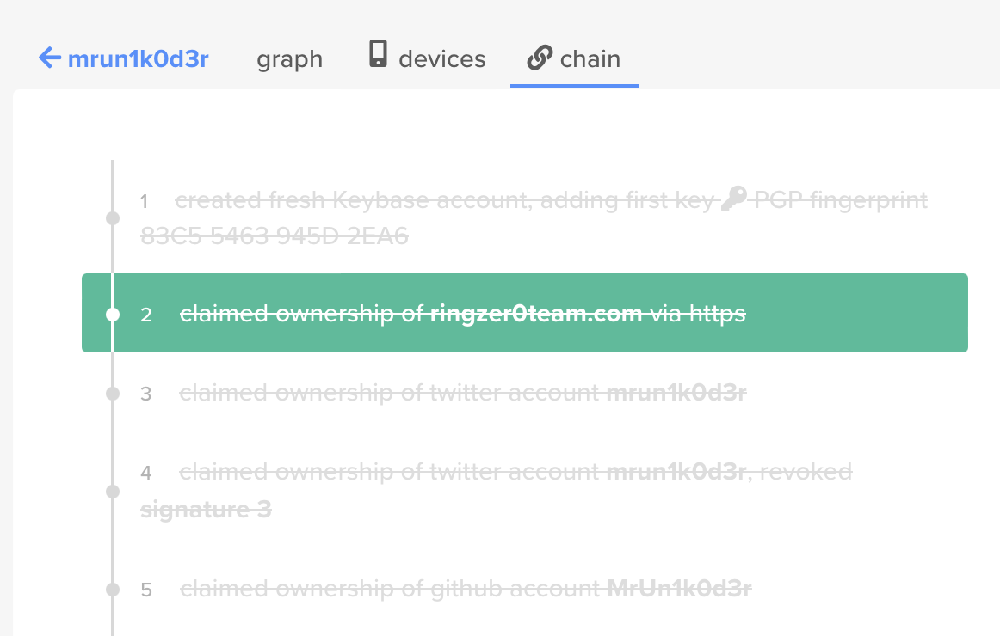

# Who I am part 2

## Challenge Details 

- **CTF:** RingZer0
- **Category:** Forensics
- **Points:** 1

## Provided Materials

- Text `I'm the proud owner of this website. Can you verify that?`

## Solution

Based on the task description we need to verify that `Mr.Un1k0d3r` *(challenge creator)* is the owner of `ringzer0ctf.com`.

So with googling the username `Mr.Un1k0d3r` we found his [keybase](https://keybase.io/mrun1k0d3r/sigchain#3f28323110ed048740148423f7b198375f7accac62341c78434f0d4a540683fc0f) profile *(Keybase is a key directory that maps social media identities to encryption keys (including, but not limited to PGP keys) in a publicly auditable manner*). 

We can see, that he has claimed ownership of `ringzer0team.com`. For that the website needs to have [keybase.txt](https://keybase.io/docs/keybase_well_known) file in the root directory. So let's check it for [https://ringzer0ctf.com/keybase.txt](https://ringzer0ctf.com/keybase.txt). And indeed our flag is at the bottom of the page.

## Final Flag

`FLAG-7A7i0V2438xL95z2X2Z321p30D8T433Z`

*Created by [bu19akov](https://github.com/bu19akov)*