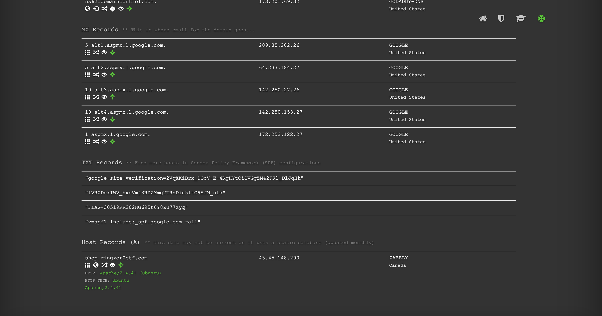

# Who I am?

## Challenge Details 

- **CTF:** RingZer0
- **Category:** Forensics
- **Points:** 2

## Provided Materials

- Text `I'm looking for information about me! The website...`

## Solution

Where is information about the domain stored? A `DNS TXT` record serves the purpose of storing textual information within a DNS server. This data can be accessed by executing the following command:

```sh
$ nslookup -type=TXT ringzer0ctf.com
Server:		8.8.8.8
Address:	8.8.8.8#53

Non-authoritative answer:
ringzer0ctf.com	text = "google-site-verification=2VqXKiBrx_DOcV-E-4RgHYtCiCVGgZM42FKl_DlJqHk"
ringzer0ctf.com	text = "1VR0DekIWV_hxeVmj3RDZMmg2TRnDin5ltO9AJM_u1s"
ringzer0ctf.com	text = "FLAG-305l9RR202HG695t6Y8ZU77xyq"
ringzer0ctf.com	text = "v=spf1 include:_spf.google.com ~all"
```

Or by using [dnsdumpster](https://dnsdumpster.com) *(domain research tool that can discover hosts related to a domain*):



## Final Flag

`FLAG-305l9RR202HG695t6Y8ZU77xyq`

*Created by [bu19akov](https://github.com/bu19akov)*