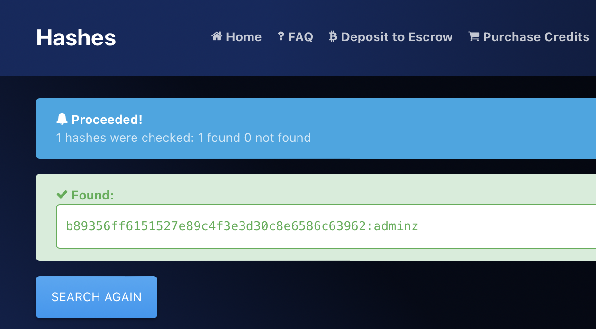

# Hashing is more secure

## Challenge Details 

- **CTF:** RingZer0
- **Category:** JavaScript
- **Points:** 1

## Provided Materials

- Password field

## Solution

We can find following script while analyzing the page with `Web-Inspector`:

```javascript
<script>
// Look's like weak JavaScript auth script :)
$(".c_submit").click(function(event) {
    event.preventDefault();
    var p = $("#cpass").val();
    if (Sha1.hash(p) == "b89356ff6151527e89c4f3e3d30c8e6586c63962") {
        if (document.location.href.indexOf("?p=") == -1) {
            document.location = document.location.href + "?p=" + p;
        }
    } else {
        $("#cresponse").html("<div class='alert alert-danger'>Wrong password sorry.</div>");
    }
});
</script>
```

We can use [hashes.com](https://hashes.com/en/decrypt/hash) to crack the hash and get our password:



## Final Flag

`FLAG-bXNsYg9tLCaIX6h1UiQMmMYB`

*Created by [bu19akov](https://github.com/bu19akov)*