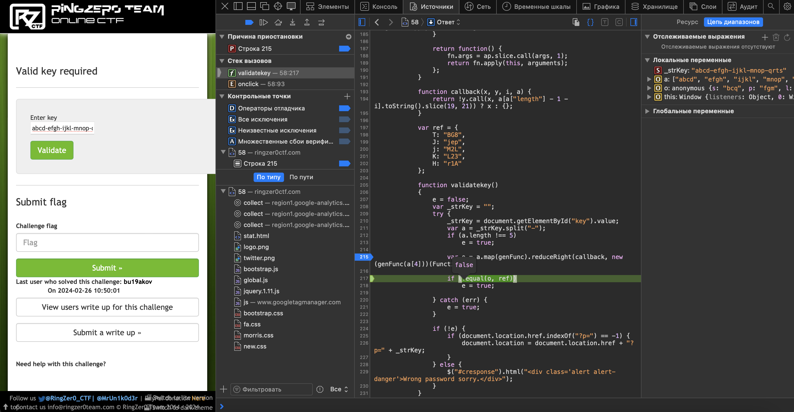

# Valid key required

## Challenge Details 

- **CTF:** RingZer0
- **Category:** JavaScript
- **Points:** 2

## Provided Materials

- `Enter key` form

## Solution

We need to submit a single key string. The JavaScript that validates the submitted key splits it at every "-" sign. It then compares the resulting sections to ensure that the key is correctly structured, requiring that it consists of 5 parts:

```js
_strKey = document.getElementById("key").value;
var a = _strKey.split("-");
if (a.length !== 5)
    e = true;

var o = a.map(genFunc).reduceRight(callback, new (genFunc(a[4]))(Function));

if (!equal(o, ref))
    e = true;
```

The map function incorporates an additional JavaScript verification to ensure each section contains exactly 4 digits. The key is generated by shuffling and then formatted into an object that must align with the following structure:

```js
{
  T: "BG8",
  J: "jep",
  j: "M2L",
  K: "L23",
  H: "r1A"
}
```

I put the breakpoint at `var o = a.map(genFunc).reduceRight(callback, new (genFunc(a[4]))(Function));` and then tried the key `abcd-efgh-ijkl-mnop-qrts`:



```
abcd-efgh-ijkl-mnop-qrts -> {s: "bcq", p: "fgm", l: "jki", h: "noe", d: "rta"}
```

We can see that ech last character in a section is a key in `o` variable. So to have `{T : "BG8",J : "jep",j : "M2L",K : "L23",H : "r1A"}` we need to enter `???H-???K-???j-???J-???T`.

So after multiple matching steps we could determine, that to have `{T : "BG8",J : "jep",j : "M2L",K : "L23",H : "r1A"}` we need to enter `ABGH-3jeK-LM2j-pL2J-8r1T`.

## Final Flag

`FLAG-ONj755sYn2Js8C96h2L662Jz`

*Created by [bu19akov](https://github.com/bu19akov)*