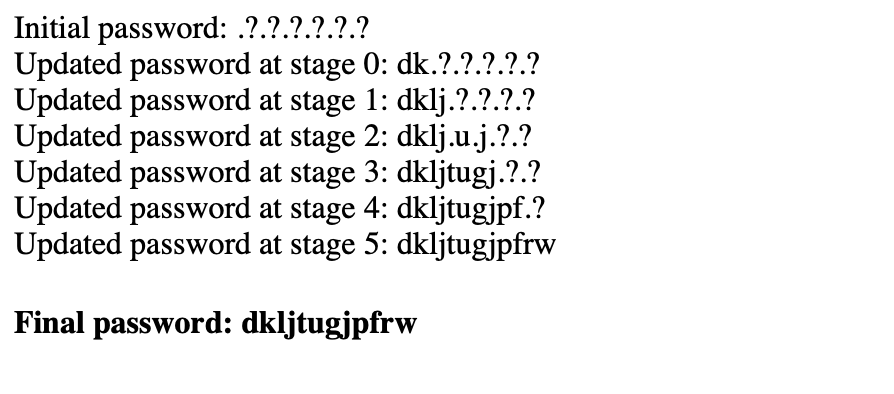

# WTF Lol!

## Challenge Details 

- **CTF:** RingZer0
- **Category:** JavaScript
- **Points:** 6

## Provided Materials

- Password input

## Solution

With `Developer Tools` we can find following script:

```js

function check_password(password) {
	var stack = "qwertyuiopasdfghjklzxcvbnm".split("");
	var tmp = {
		"t" : 9, "h" : 6, "e" : 5,
		"f" : 1, "l" : 2, "a" : 3, "g" : 4,
		"i" : 7, "s" : 8, 
		"j" : 10, "u" : 11, "m" : 12, "p" : 13,
		"b" : 14, "r" : 15, "o" : 16, "w" : 17, "n" : 18,
		"c" : 19, "d" : 20, "j" : 21, "k" : 22, "q" : 23, 
		"v" : 24, "x" : 25, "z" : 26
	};

	var i = 2;

	var a1 = Number.prototype.valueOf;
	var a2 = Number.prototype.toString;
	var a3 = Array.prototype.valueOf;
	var a4 = Array.prototype.toString;
	var a5 = Object.prototype.valueOf;
	var a6 = Object.prototype.toString;

	function f1() { return stack[ i++ % stack.length ].charCodeAt(0); }
	function f2() { i += 3; return stack.pop(); }
	function f3() { 
		for (k in this) { 
			if (this.hasOwnProperty(k)) {
				i += stack.indexOf(this[k][0]);	
				stack.push(this[k]); 
			} 
		} 
		return String.fromCharCode(new Number(stack[ i % stack.length ].charCodeAt(0))); 
	}

	Number.prototype.valueOf = Number.prototype.toString = f1;
	Array.prototype.valueOf  = Array.prototype.toString  = f2;
	Object.prototype.valueOf = Object.prototype.toString = f3;

	var a  = (tmp[ [] ] * tmp[ [] ] * 1337 + tmp[ "" + { "wtf": password[1] } ]) / (tmp[ "" + { "wtf": password[0] } ] - tmp[ [] ]);
	var b  = (tmp[ [] ] * tmp[ [] ] * 7331 + tmp[ "" + { "lol": "o" } ]) / (tmp[ "" + { "wtf": password[1] } ] - tmp[ [] ]);
	var c  = (tmp[ [] ] * tmp[ [] ] * 1111 + tmp[ "" + { "wtf": password[3] } ]) / (tmp[ "" + { "lol": password[2] } ] - tmp[ [] ]);
	var d  = (tmp[ [] ] * tmp[ [] ] * 3333 + tmp[ "" + { "wtf": "g" } ]) / (tmp[ "" + { "wtf": password[3] } ] - tmp[ [] ]);
	var e  = (tmp[ [] ] * tmp[ [] ] * 7777 + tmp[ "" + { "wtf": "a" } ]) / (tmp[ "" + { "wtf": password[7] } ] - tmp[ [] ]);
	var f  = (tmp[ [] ] * tmp[ [] ] * 2222 + tmp[ "" + { "wtf": password[7] } ]) / (tmp[ "" + { "lol": password[5] } ] - tmp[ [] ]);
	var g  = (tmp[ [] ] * tmp[ [] ] * 6666 + tmp[ "" + { "lol": password[4] } ]) / (tmp[ "" + { "wtf": password[6] } ] - tmp[ [] ]);
	var h  = (tmp[ [] ] * tmp[ [] ] * 1234 + tmp[ "" + { "wtf": "a" } ]) / (tmp[ "" + { "wtf": password[4] } ] - tmp[ [] ]);
	var ii = (tmp[ [] ] * tmp[ [] ] * 2345 + tmp[ "" + { "wtf": "h" } ]) / (tmp[ "" + { "wtf": password[9] } ] - tmp[ [] ]);
	var j  = (tmp[ [] ] * tmp[ [] ] * 3456 + tmp[ "" + { "wtf": password[9] } ]) / (tmp[ "" + { "lol": password[8] } ] - tmp[ [] ]);
	var kk = (tmp[ [] ] * tmp[ [] ] * 4567 + tmp[ "" + { "lol": password[11] } ]) / (tmp[ "" + { "wtf": password[10] } ] - tmp[ [] ]);
	var l  = (tmp[ [] ] * tmp[ [] ] * 9999 + tmp[ "" + { "wtf": "o" } ]) / (tmp[ "" + { "wtf": password[11] } ] - tmp[ [] ]);

	Number.prototype.valueOf   = a1;
	Number.prototype.toString  = a2;
	Array.prototype.valueOf    = a3;
	Array.prototype.toString   = a4;
	Object.prototype.valueOf   = a5;
	Object.prototype.toString  = a6;

	var m = a === b && b === c && c === d && d === e && e === f && f === g && g === h && h === ii && ii === j && j === kk && kk === l;
	var n = password[0] != password[1] && password[2] != password[3] && password[4] != password[5]  && password[6] != password[7]  && password[8] != password[9] && password[10] != password[11]

	return m && n;
}
```

By analyzing the code we can determine, that the password will be exactly 12 characters long.

Upon further analysis of the code, I observed that pairs of successive variables are linked to pairs of characters. For instance, the pairs `a and b`, `c and d`, `e and f`, `g and h`, `ii and j`, and `kk and l` demonstrate this dependency. This pattern suggests the possibility of applying a brute force attack two characters at a time, requiring six iterations in total. To accomplish this, the `check_password` function can be utilized, albeit with slight modifications.

Since the `tmp` array within the `check_password` function is exclusively comprised of lowercase letters, the brute force attack is conducted solely using lowercase letters, ranging from `a` to `z`:

```html
<!DOCTYPE html>
<html>
<body>
<script>
function check_password(password, Batch) {
    var stack = "qwertyuiopasdfghjklzxcvbnm".split("");
    var tmp = {
        "t": 9, "h": 6, "e": 5, "f": 1, "l": 2, "a": 3, "g": 4, "i": 7, "s": 8,
        "j": 21, "u": 11, "m": 12, "p": 13, "b": 14, "r": 15, "o": 16, "w": 17, "c": 19, "d": 20, "k": 22, "v": 24, "x": 25, "z": 26, "n": 18, "q": 23
    };
    var i = 2;

    var a1 = Number.prototype.valueOf;
    var a2 = Number.prototype.toString;
    var a3 = Array.prototype.valueOf;
    var a4 = Array.prototype.toString;
    var a5 = Object.prototype.valueOf;
    var a6 = Object.prototype.toString;

    function f1() {
        return stack[ i++ % stack.length ].charCodeAt(0);
    }

    function f2() {
        i += 3;
        return stack.pop();
    }

    function f3() {
        for (k in this) {
            if (this.hasOwnProperty(k)) {
                i += stack.indexOf(this[k][0]);
                stack.push(this[k]);
            }
        }
        return String.fromCharCode(new Number(stack[ i % stack.length ].charCodeAt(0)));
    }

    Number.prototype.valueOf = Number.prototype.toString = f1;
    Array.prototype.valueOf = Array.prototype.toString = f2;
    Object.prototype.valueOf = Object.prototype.toString = f3;

    var a, b, c, d, e, f, g, h, ii, j, kk, l, m, n;

    if (Batch >= 0) {
        a = (tmp[[]] * tmp[[]] * 1337 + tmp["" + {"wtf": password[1]}]) / (tmp["" + {"wtf": password[0]}] - tmp[[]]);
        b = (tmp[[]] * tmp[[]] * 7331 + tmp["" + {"lol": "o"}]) / (tmp["" + {"wtf": password[1]}] - tmp[[]]);
    }
    if (Batch >= 1) {
        c = (tmp[[]] * tmp[[]] * 1111 + tmp["" + {"wtf": password[3]}]) / (tmp["" + {"lol": password[2]}] - tmp[[]]);
        d = (tmp[[]] * tmp[[]] * 3333 + tmp["" + {"wtf": "g"}]) / (tmp["" + {"wtf": password[3]}] - tmp[[]]);
    }
    if (Batch >= 2) {
        e = (tmp[[]] * tmp[[]] * 7777 + tmp["" + {"wtf": "a"}]) / (tmp["" + {"wtf": password[7]}] - tmp[[]]);
        f = (tmp[[]] * tmp[[]] * 2222 + tmp["" + {"wtf": password[7]}]) / (tmp["" + {"lol": password[5]}] - tmp[[]]);
    }
    if (Batch >= 3) {
        g = (tmp[[]] * tmp[[]] * 6666 + tmp["" + {"lol": password[4]}]) / (tmp["" + {"wtf": password[6]}] - tmp[[]]);
        h = (tmp[[]] * tmp[[]] * 1234 + tmp["" + {"wtf": "a"}]) / (tmp["" + {"wtf": password[4]}] - tmp[[]]);
    }
    if (Batch >= 4) {
        ii = (tmp[[]] * tmp[[]] * 2345 + tmp["" + {"wtf": "h"}]) / (tmp["" + {"wtf": password[9]}] - tmp[[]]);
        j = (tmp[[]] * tmp[[]] * 3456 + tmp["" + {"wtf": password[9]}]) / (tmp["" + {"lol": password[8]}] - tmp[[]]);
    }
    if (Batch >= 5) {
        kk = (tmp[[]] * tmp[[]] * 4567 + tmp["" + {"lol": password[11]}]) / (tmp["" + {"wtf": password[10]}] - tmp[[]]);
        l = (tmp[[]] * tmp[[]] * 9999 + tmp["" + {"wtf": "o"}]) / (tmp["" + {"wtf": password[11]}] - tmp[[]]);
    }

    Number.prototype.valueOf = a1;
    Number.prototype.toString = a2;
    Array.prototype.valueOf = a3;
    Array.prototype.toString = a4;
    Object.prototype.valueOf = a5;
    Object.prototype.toString = a6;

    if (Batch >= 0) m = a === b;
    if (Batch >= 1) m = b === c && c === d;
    if (Batch >= 2) m = d === e && e === f;
    if (Batch >= 3) m = f === g && g === h;
    if (Batch >= 4) m = h === ii && ii === j;
    if (Batch >= 5) m = j === kk && kk === l;

    n = password[0] != password[1] && password[2] != password[3] && password[4] != password[5] && password[6] != password[7] && password[8] != password[9] && password[10] != password[11];

    return m && n;
}

// Our script:
var keyOrder = [0, 1, 2, 3, 7, 5, 6, 4, 9, 8, 10, 11]; 
var secret = Array(12).fill('?');
secret = secret.map((_, i) => i % 2 === 0 ? '.' : '?');
document.write("Initial password: " + secret.join("") + "<br>");

for (let stage = 0; stage < 6; stage++) {
    let found = false;
    for (let charCode1 = 97; !found && charCode1 <= 122; charCode1++) {
        secret[keyOrder[stage * 2]] = String.fromCharCode(charCode1);
        for (let charCode2 = 97; !found && charCode2 <= 122; charCode2++) {
            secret[keyOrder[(stage * 2) + 1]] = String.fromCharCode(charCode2);
            found = check_password(secret.join(""), stage);
            if (found) document.write("Updated password at stage " + stage + ": " + secret.join("") + "<br>");
        }
    }
}
document.write("<h4>Final password: " + secret.join("") + "</h4><br>");
</script>
</body>
</html>
```



## Final Flag

`dkljtugjpfrw`

*Created by [bu19akov](https://github.com/bu19akov)*