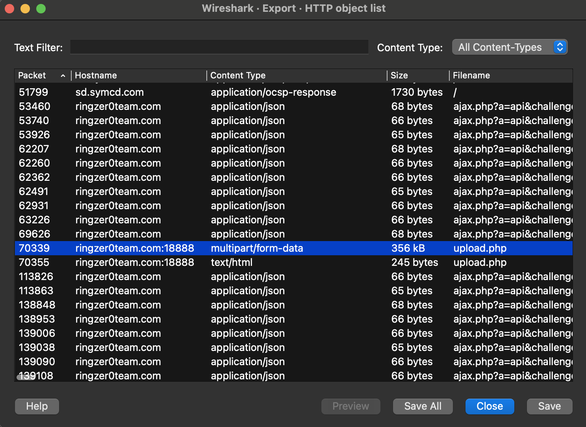
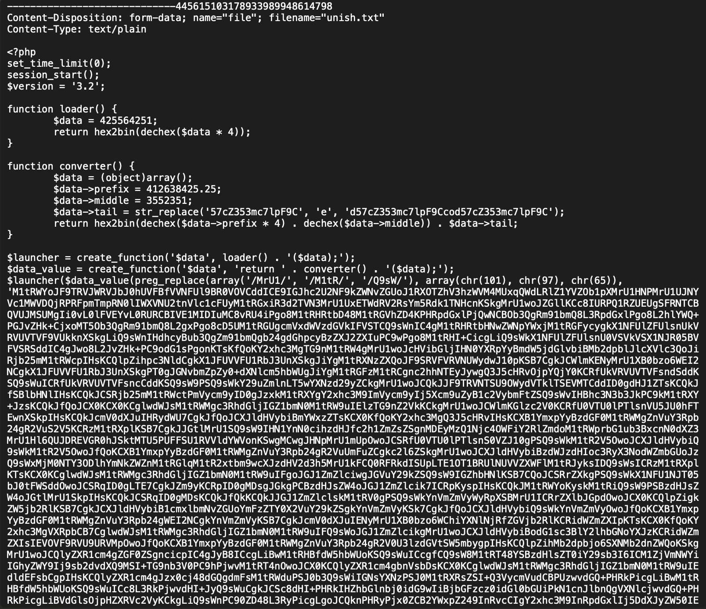
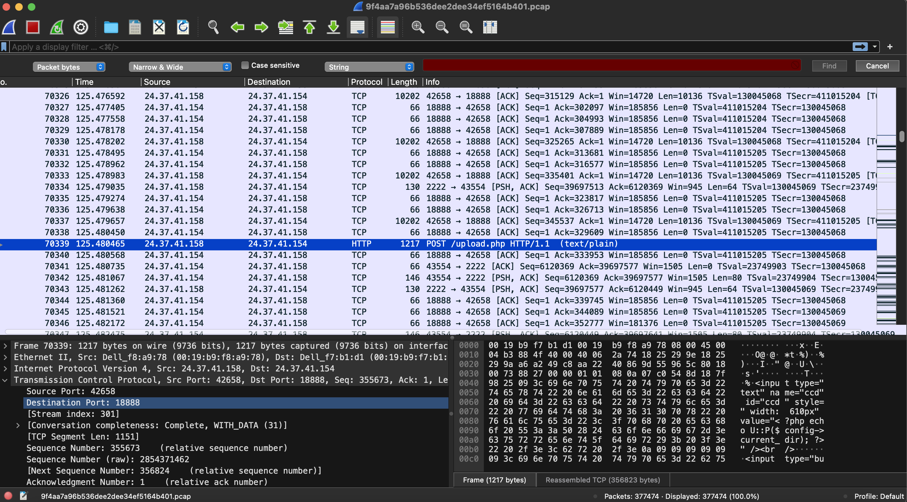

# Capture 1 Part 1

## Challenge Details 

- **CTF:** RingZer0
- **Category:** Malware Analysis
- **Points:** 1

## Provided Materials

- `.pcap` file

## Solution

We can use [Wireshark](https://www.wireshark.org) to analyze `.pcap` files. So when we open our file in `Wireshark` we can see a lot of traffic, so let's see if there is something unusual in `HTTP Objects` *(`File` -> `Export Objects` -> `HTTP`)*:

So we can see, that the `upload.php` file in the packet `70339` is bigger than other `upload.php` files, so let's save it and see:

And indeed it looks strange for `upload.php` file, so let's find the host `IP` and `port` in packet `70339`:

The exploited server `IP` is `24.37.41.154` and the `port` is `18888`.

## Final Flag

`24.37.41.154:18888`

*Created by [bu19akov](https://github.com/bu19akov)*