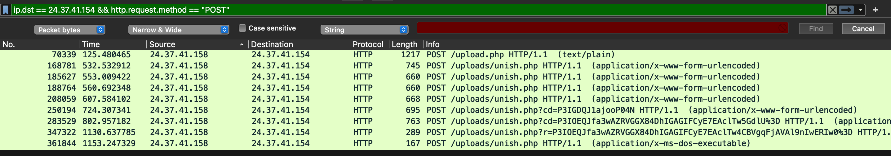
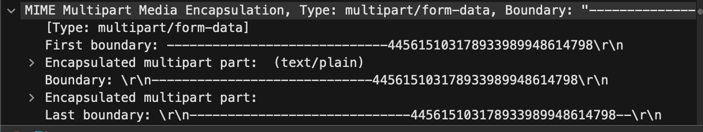
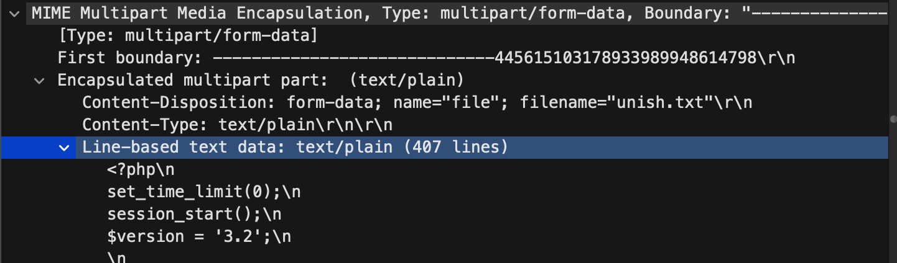

# Capture 1 Part 2

## Challenge Details 

- **CTF:** RingZer0
- **Category:** Malware Analysis
- **Points:** 1

## Provided Materials

- `.pcap` file

## Solution

*(Read [Capture 1 Part 1](https://github.com/bu19akov/CTF-Challenge-Solutions/blob/main/RingZer0_CTF/malware_analysis/Capture%201%20Part%201%20(1p)/solution.md) first)*

We need now to `calculate the md5sum of the first backdoor`. So, firstly, let's find it. For that we can use `Wireshark` filter `ip.dst == 24.37.41.154 && http.request.method == "POST"` to see only `POST` requests to the exploited server:



So, obviously, the backdoor is in the packet `70339` *(We have downloaded it in Capture 1 Part 1)*. Let's analyze it further. As we can see the packet has several ecapsulated multipart parts: 



As we are interested only in backdoor itself, we should look into `Encapsulated multipart part: (text/plain)`:



We can export the whole `line-based text data` *(`Double-click` -> `Export Packet Bytes`)* and then save it like `backdoor.txt`. 

Then we just need to find the `md5sum` of this file:

```sh
$ md5sum backdoor.txt  
03feef292b215939f182a61aa3896c2c
```

## Final Flag

`03feef292b215939f182a61aa3896c2c`

*Created by [bu19akov](https://github.com/bu19akov)*