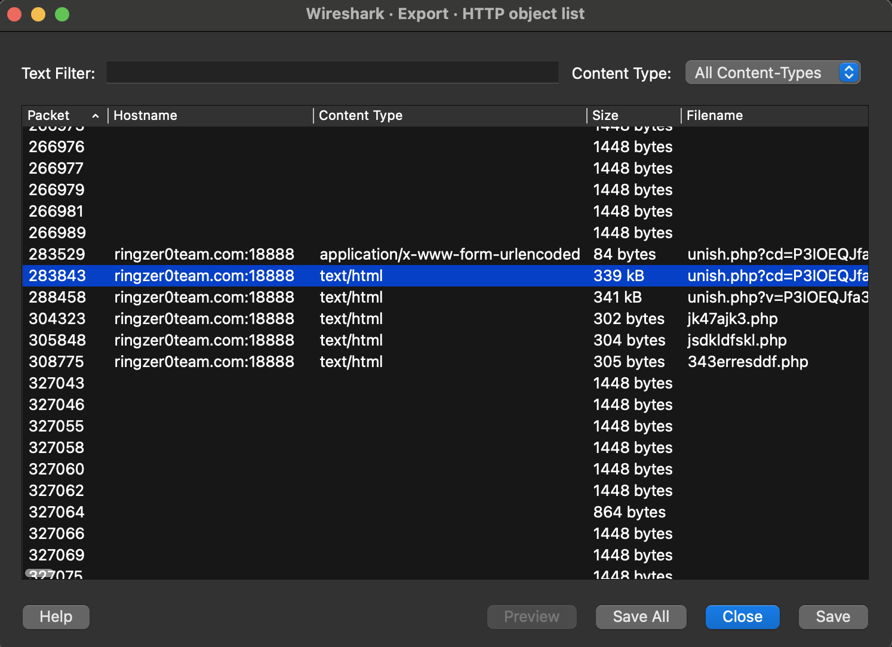
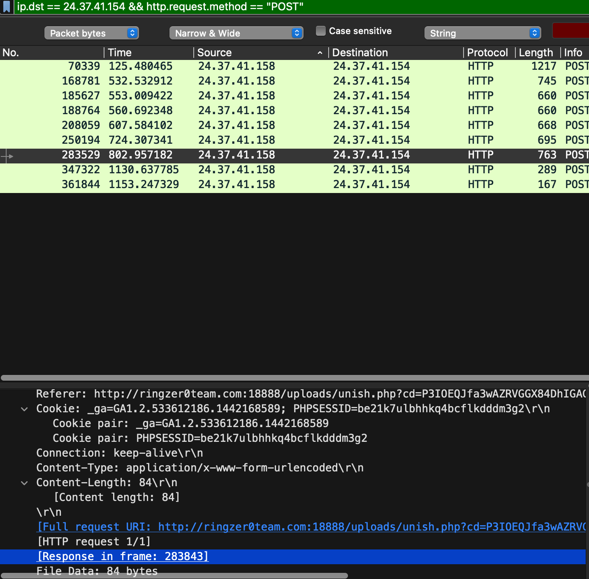
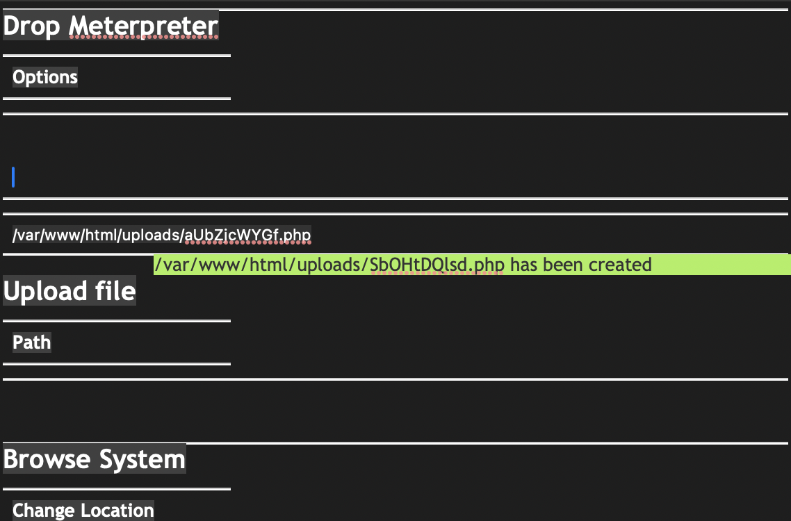

# Capture 1 Part 3

## Challenge Details 

- **CTF:** RingZer0
- **Category:** Malware Analysis
- **Points:** 1

## Provided Materials

- `.pcap` file

## Solution

In `part 3` we have to `retrieve the dropped PHP meterpreter filename`, so if we look at `HTTP Objects` *(From Part 1)* more closely:

We can find out that packet `283843` is response to packet `283529` *(that creates the meterpreter)*:

So if we download the file from packet `283843`, we can see the `meterpreter filename`:

## Final Flag

`SbOHtDQlsd.php`

*Created by [bu19akov](https://github.com/bu19akov)*