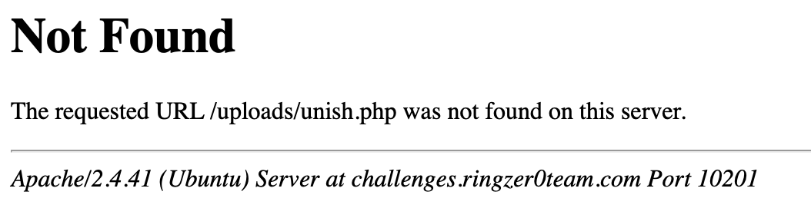
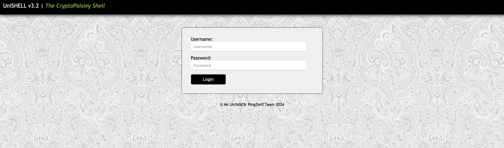
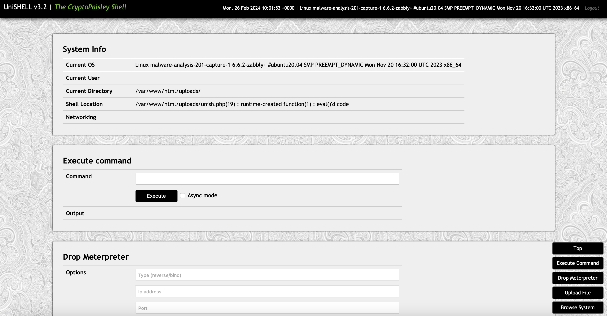
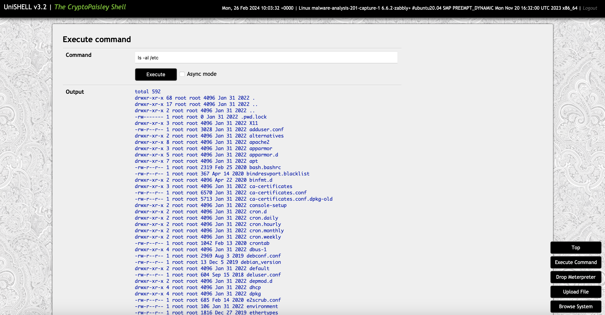
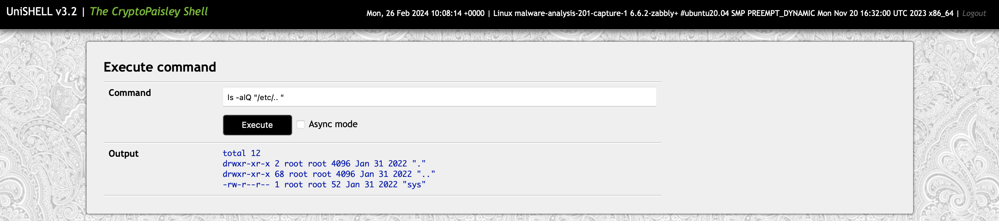
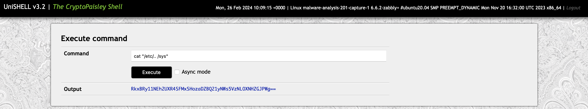

# Capture 1 Part 4

## Challenge Details 

- **CTF:** RingZer0
- **Category:** Malware Analysis
- **Points:** 2

## Provided Materials

- `.pcap` file

## Solution

*(Read [Capture 1 Part 5](https://github.com/bu19akov/CTF-Challenge-Solutions/blob/main/RingZer0_CTF/malware_analysis/Capture%201%20Part%205%20(3p)/solution.md) first)*

In `Part 5` we have found administrator's password, so we can try to access `challenges.ringzer0ctf.com:10201/uploads/unish.php`:



Hm, let's analyze request from `Wireshark`:

```
POST /uploads/unish.php HTTP/1.1
Host: ringzer0team.com:18888
User-Agent: Mozilla/5.0 (UniShell; Linux x86_64; v.1) UniShell/1,2,3 Agent/1.0
Accept: text/html,application/xhtml+xml,application/xml;q=0.9,*/*;q=0.8
Accept-Language: en-US,en;q=0.5
Accept-Encoding: gzip, deflate
Referer: http://ringzer0team.com:18888/uploads/unish.php
Cookie: _ga=GA1.2.533612186.1442168589; PHPSESSID=be21k7ulbhhkq4bcflkdddm3g2; _gat=1
Connection: keep-alive
Content-Type: application/x-www-form-urlencoded
Content-Length: 159

u=EiU5EA9fITsWNwJfCg%3D%3D&p=7fdacaf29839fedec0268d6e0441a95cea7c83627ef43afdd74d45d2c3f750d05b579a4602eeadedac315c39967bc7b245f244188303b330c691b0f2c4975378
```

We can see here some unusual `User-Agent` header, so let's try to switch it in our browser ([Safari](https://documentation.avaya.com/ru-RU/bundle/IPOfficeWorkplaceInstall/page/UA_Spoofing_Safari.html), [Chrome](https://www.searchenginejournal.com/change-user-agent/368448/)) to `Mozilla/5.0 (UniShell; Linux x86_64; v.1) UniShell/1,2,3 Agent/1.0`:



Nice! Let's try to login with `administrator:R00troot`:



Good, we're in! We can execute commands here, so let's see first, what's inside `/etc`:



Hmmm, two `..` directories... Very unusual, let's analyze it further. `ls -laQ` will enclose file names in quotation marks, which can help reveal if there are non-visible characters in one of the directory names:


And indeed one of the directories is `".. "`, so let's see what's inside it with `ls -alQ "/etc/.. "`:



Readable `sys` file, let's output it with `cat "/etc/.. /sys"`:



Obviously some `base64` encoded text, let's decode it:

```sh
$ echo "RkxBRy11NEh2UXR4SFMxSHozaDZBQ21yNWs5VzNLOXNHZGJPWg==" | base64 -d
FLAG-u4HvQtxHS1Hz3h6ACmr5k9W3K9sGdbOZ
```


## Final Flag

`FLAG-u4HvQtxHS1Hz3h6ACmr5k9W3K9sGdbOZ`

*Created by [bu19akov](https://github.com/bu19akov)*