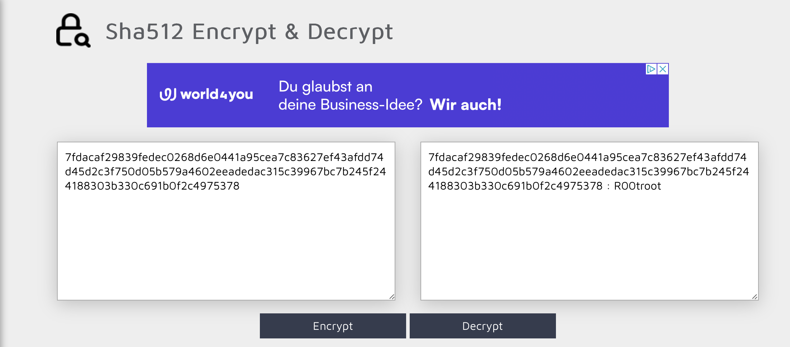

# Capture 1 Part 5

## Challenge Details 

- **CTF:** RingZer0
- **Category:** Malware Analysis
- **Points:** 3

## Provided Materials

- `.pcap` file

## Solution

We need to `retrieve the password of the backdoor`. By analyzing the backdoor *(unish.php)* we can see following code part at the end:

```html
<div class="box login">
	<form action="" method="post" id="login">
		Username:<br />
		<input type="text" name="u" id="u" placeholder="Username" /><br />
		Password:<br />
		<input type="password" name="p" id="p" placeholder="Password" /><br />
		<input type="button" onclick="prepare('login', ['u', 'p'])" value="Login" class="btn" /><br />
	</form>
	<?php echo $config->error; ?>
</div>
```

So it uses `prepare` function with `login` and `['u', 'p']` parameters for login, let's find `prepare` function:

```php
function prepare(current, array) {
	var async = document.getElementById("async") == null ? false : document.getElementById("async").checked;
	if(!async) {
		for(index = 0; index < array.length; index++) {
			element = document.getElementById(array[index]);		
			if(current == "login" && array[index] == "p") {
				element.value = CryptoJS.SHA512(element.value);
			} else {
				element.value = crypto(element.value);
			}
		}	
		document.getElementById(current).submit();
	} else {
		...
	}
}
```

So we can see, that if `prepare` function is called with `current=login` and if the array value by iterating is `p` it wil be hashed with `SHA512` algorithm *(The password will be hashed)*.

And in `Wireshark` we can find the `POST` request to `/uploads/unish.php` with arguments `u=EiU5EA9fITsWNwJfCg==` and `p=7fdacaf29839fedec0268d6e0441a95c...`, so the only thing is left to do is to decrypt this hashed password. For that we can use [this](https://md5decrypt.net/en/Sha512/) online tool:




## Final Flag

`R00troot`

*Created by [bu19akov](https://github.com/bu19akov)*