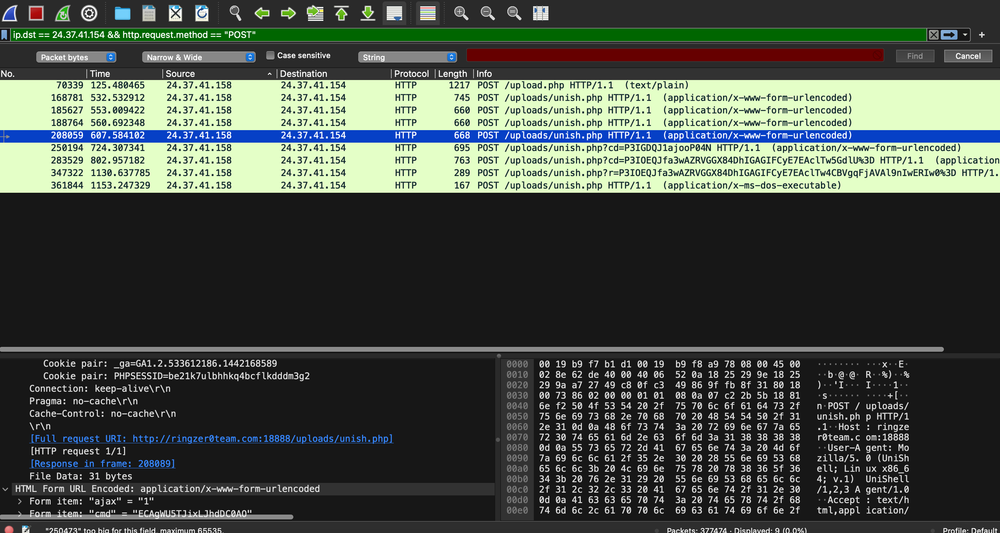
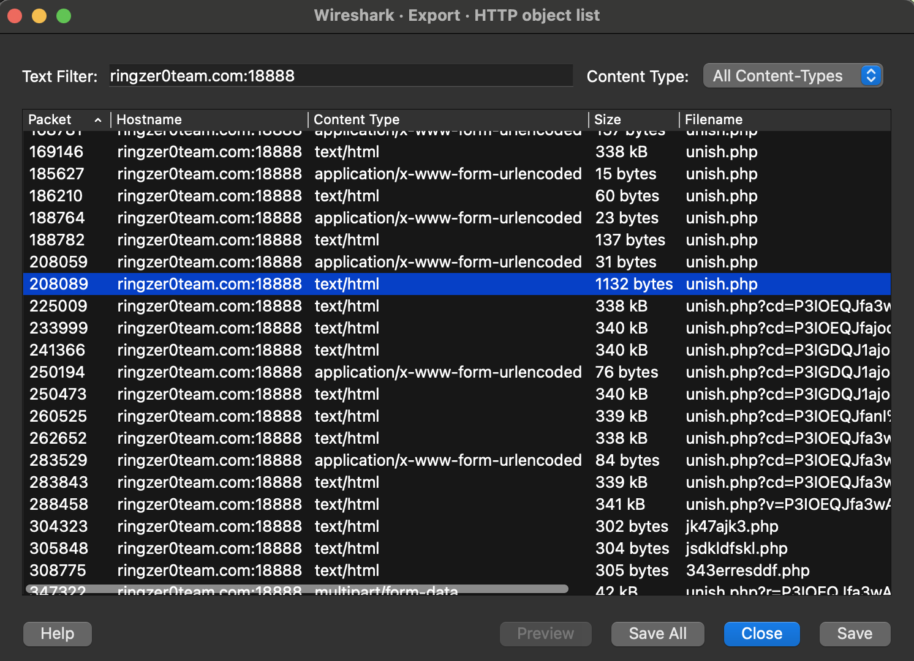

# Capture 1 Part 6

## Challenge Details 

- **CTF:** RingZer0
- **Category:** Malware Analysis
- **Points:** 3

## Provided Materials

- `.pcap` file

## Solution

Here we can see all the requests, that the attacker made:



The 3rd request is in packet `208059` and the response to it is in packet `208089`, so let's download it and see what's inside:



And here is the content:

```sh
root:x:0:0:root:/root:/bin/bash<br />
daemon:x:1:1:daemon:/usr/sbin:/usr/sbin/nologin<br />
bin:x:2:2:bin:/bin:/usr/sbin/nologin<br />
sys:x:3:3:sys:/dev:/usr/sbin/nologin<br />
sync:x:4:65534:sync:/bin:/bin/sync<br />
games:x:5:60:games:/usr/games:/usr/sbin/nologin<br />
man:x:6:12:man:/var/cache/man:/usr/sbin/nologin<br />
lp:x:7:7:lp:/var/spool/lpd:/usr/sbin/nologin<br />
mail:x:8:8:mail:/var/mail:/usr/sbin/nologin<br />
news:x:9:9:news:/var/spool/news:/usr/sbin/nologin<br />
uucp:x:10:10:uucp:/var/spool/uucp:/usr/sbin/nologin<br />
proxy:x:13:13:proxy:/bin:/usr/sbin/nologin<br />
www-data:x:33:33:www-data:/var/www:/usr/sbin/nologin<br />
backup:x:34:34:backup:/var/backups:/usr/sbin/nologin<br />
list:x:38:38:Mailing List Manager:/var/list:/usr/sbin/nologin<br />
irc:x:39:39:ircd:/var/run/ircd:/usr/sbin/nologin<br />
gnats:x:41:41:Gnats Bug-Reporting System (admin):/var/lib/gnats:/usr/sbin/nologin<br />
nobody:x:65534:65534:nobody:/nonexistent:/usr/sbin/nologin<br />
libuuid:x:100:101::/var/lib/libuuid:<br />
sshd:x:101:65534::/var/run/sshd:/usr/sbin/nologin<br />
syslog:x:102:105::/home/syslog:/bin/false<br />
```

So the flag is obvious :)

## Final Flag

`cat /etc/passwd`

*Created by [bu19akov](https://github.com/bu19akov)*