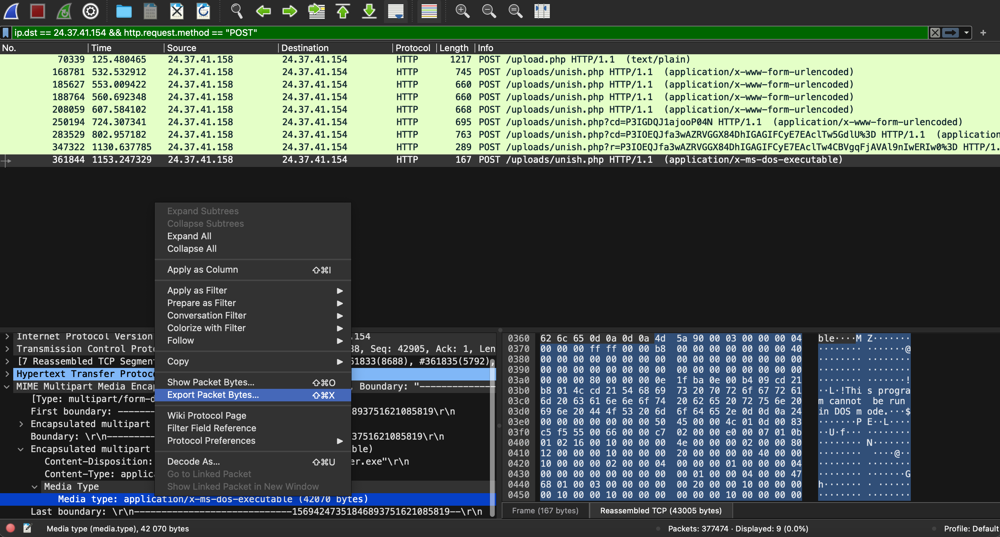
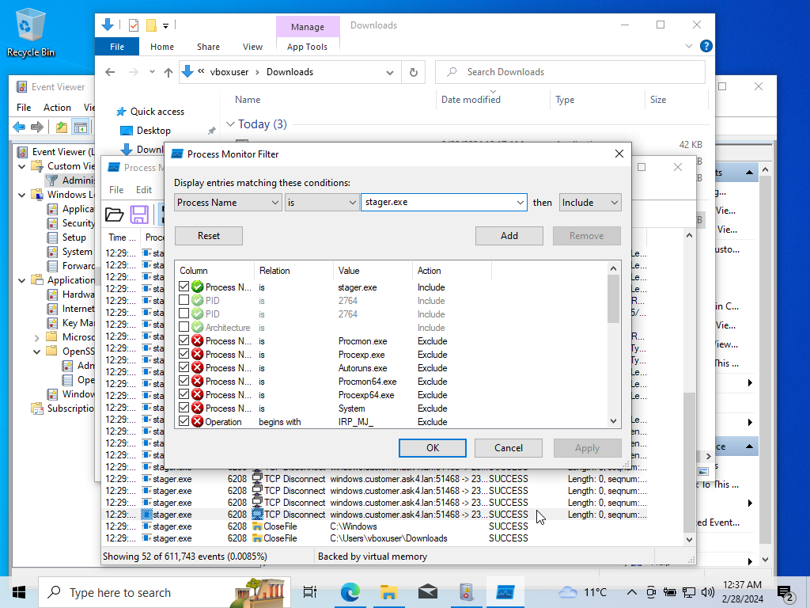
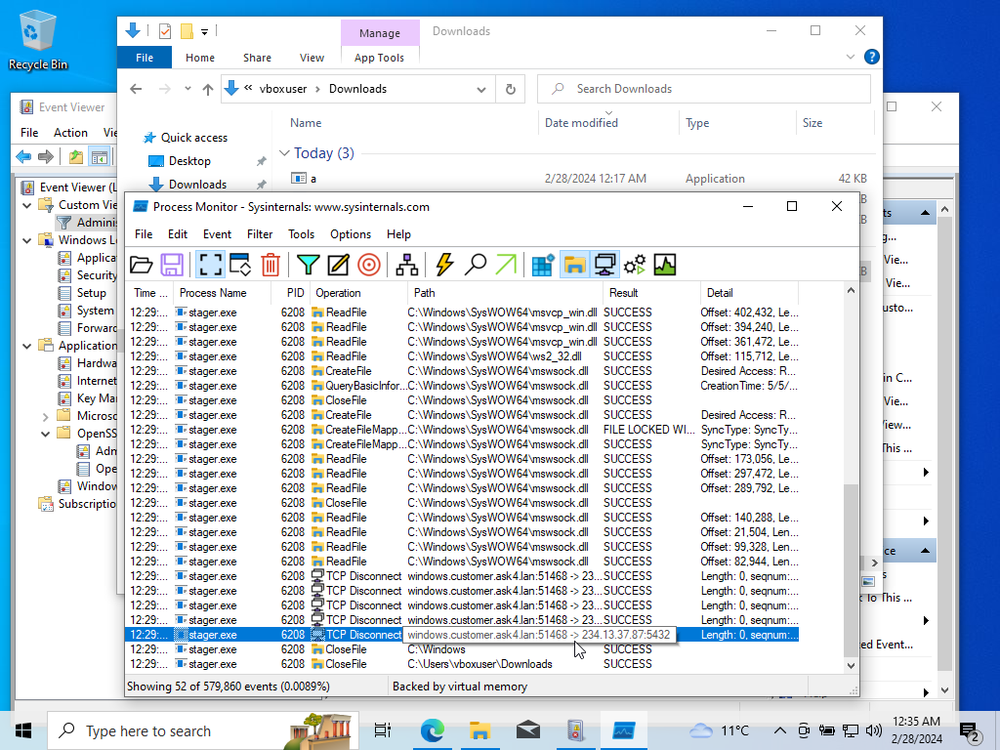

# Capture 1 Part 7

## Challenge Details 

- **CTF:** RingZer0
- **Category:** Malware Analysis
- **Points:** 3

## Provided Materials

- `.pcap` file

## Solution

We need to `retrieve the ip address and the port used on the invalid payload`.

In the last `POST` request we can find `x-ms-dos-executable` `stager.exe` file, so we can save it:

We can run `.exe` files only on `Windows` machines, so we can install `Windows 10` in `VirtualBox` and then transfer `stager.exe` to it.

To analyze the `.exe` file execution we can install [Process Monitor](https://learn.microsoft.com/en-us/sysinternals/downloads/procmon).

Then in `Process Monitor` we should create `Filter` to catch our `stager.exe` logs *(`Filter` -> `Filter...` -> `Process name is stager.exe` -> `Add` -> `OK`)*:

And then after executing `stager.exe` we can see that our machine has tried to connect to external host, but was disconnected *(When we move the cursor to that log, we can see our flag)*:

## Final Flag

`234.13.37.87:5432`

*Created by [bu19akov](https://github.com/bu19akov)*