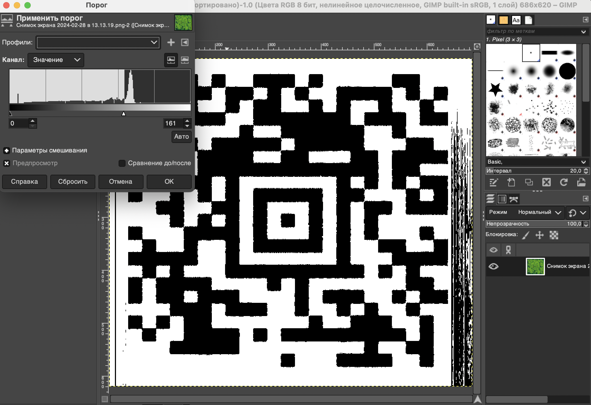

# SigID Level 1

## Challenge Details 

- **CTF:** RingZer0
- **Category:** Software Defined Radio
- **Points:** 1

## Provided Materials

- `.ogg` audio file

## Solution

We can analyze audio files with [Sonic Visualizer](https://www.sonicvisualiser.org/download.html). Once we open the file, we can use `Spectogram Layer` *(`Shift` + `G`)*:

And see the `QR code` here.

Then we can make screenshot of this `QR Code` and with the help of [Gimp](https://www.gimp.org/downloads/) set the threshold level so to make `QR code` black and white:

And then using [this](https://zxing.org/w/decode.jspx) online tool we can decode our `QR code`:

## Final Flag

`mathsRulesTheUniverse`

*Created by [bu19akov](https://github.com/bu19akov)*