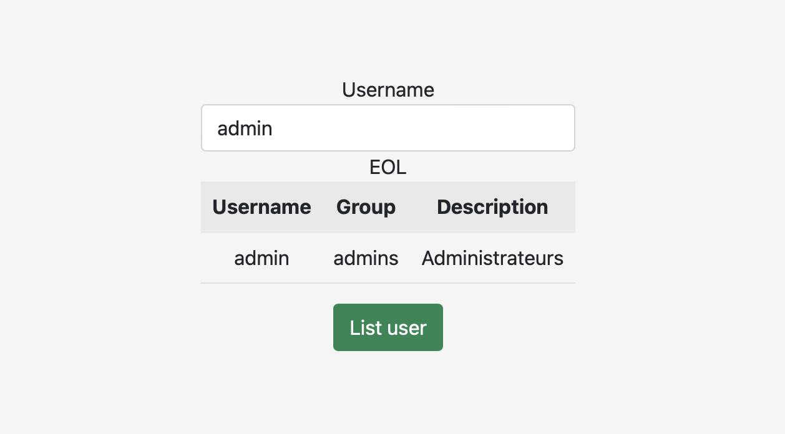
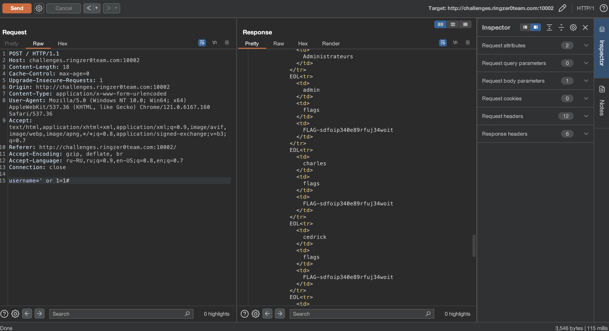

# ACL rulezzz the world.

## Challenge Details 

- **CTF:** RingZer0
- **Category:** SQL Injection
- **Points:** 2

## Provided Materials

- Web page:

## Solution

The query has to be something like `SELECT username, group, description FROM users WHERE username = 'uname'`, we can break the query with `' or 1=1#`, but we need to intercept our request to change the `username` value. We can use [Burp Suite](https://portswigger.net/burp/communitydownload) for that:

 

## Final Flag

`FLAG-sdfoip340e89rfuj34woit`

*Created by [bu19akov](https://github.com/bu19akov)*