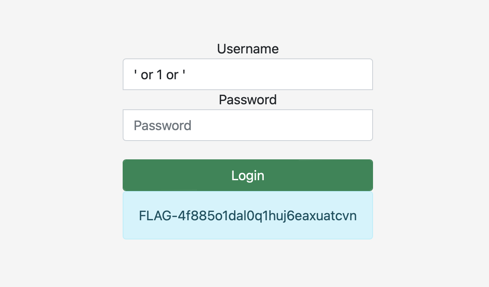

# Login portal 1

## Challenge Details 

- **CTF:** RingZer0
- **Category:** SQL Injection
- **Points:** 2

## Provided Materials

- Login form

## Solution

As we send `' or 1=1#`, we get message `Illegal characters detected.`, but the query should still be `SELECT * FROM users WHERE username='uname'`, so with a bit of playing we can detect, that `=` and `#` are illegal, so we can use `' or 1 or '`, so that the query will be `SELECT * FROM users WHERE username='' or 1 or ''`: 

## Final Flag

`FLAG-4f885o1dal0q1huj6eaxuatcvn`

*Created by [bu19akov](https://github.com/bu19akov)*