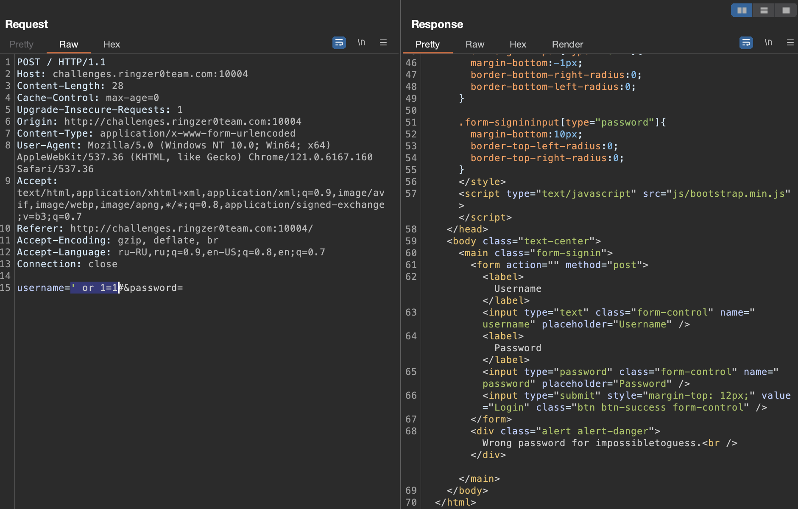
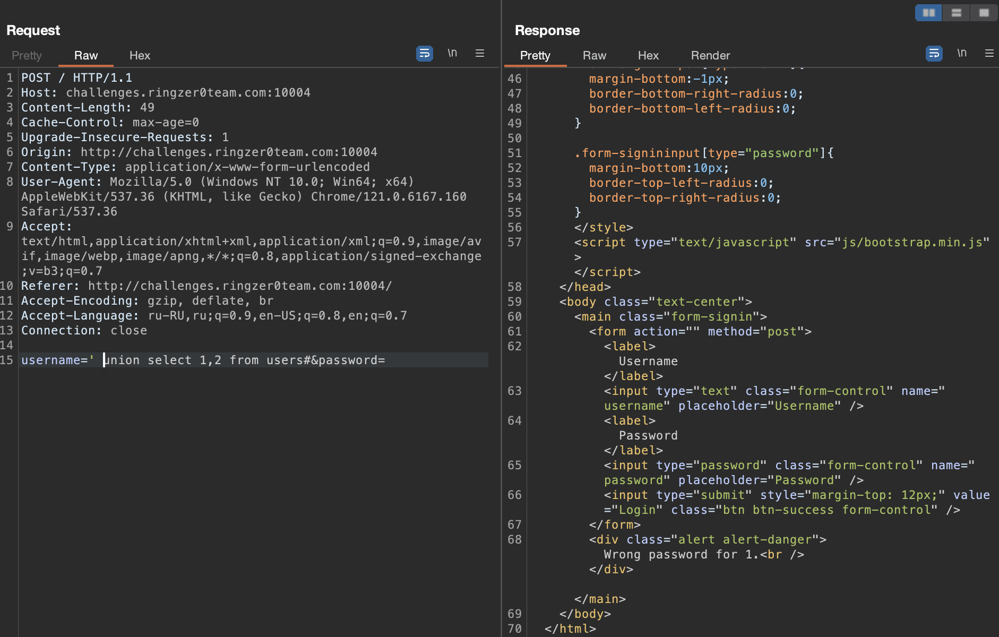
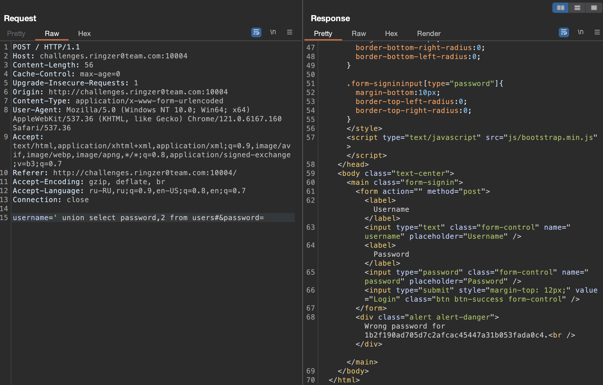
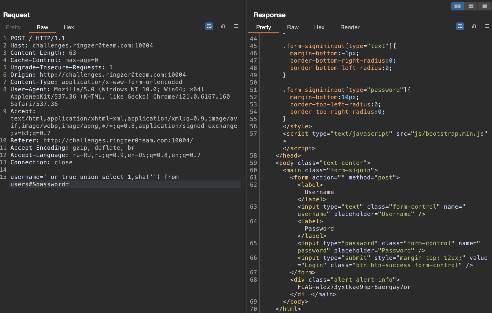

# Login portal 2

## Challenge Details 

- **CTF:** RingZer0
- **Category:** SQL Injection
- **Points:** 3

## Provided Materials

- Login form

## Solution

If we send `' or 1=1#`, we get the username:

Looks like we are dealing with two queries: the first one just checks username existance and the second one is the actual login with the results returned from the first query. Let's try to get more data from the database:

We have founded, that we can select values from database with `UNION`. Let's try to get password:

The password looks like `sha1` hash since it is 40 characters long and if we try to login with `impossibletoguess:1b2f190ad705d7c2afcac45447a31b053fada0c4` it will not be successfull...

Based on all the known information, there are 2 steps in login:

- Retrieving the username and password from the database.
- Hashing the entered password and comparing this hashed value with the one obtained from the database.

Given that we're able to inject our custom query into the username field, it's possible to select our own username and password hash, effectively circumventing the login process *(`' or true union select 1,sha('') from users#`)*:

## Final Flag

`FLAG-wlez73yxtkae9mpr8aerqay7or`

*Created by [bu19akov](https://github.com/bu19akov)*